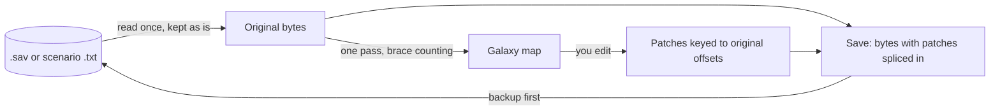

# Stellaris Galaxy Forge

Galaxy Forge is a desktop editor for Stellaris galaxy maps. It runs
outside the game, on Windows, macOS and Linux, and lets you edit both
existing save files and galaxy scenarios.

You can move star systems, draw and cut hyperlanes, add new systems to an
ongoing campaign, and inspect planets and their deposits. You can also
turn a save into a scenario and start a new game from it with the Paint a
Galaxy mod.

- Download: [the latest release](https://github.com/IanHeinrich/stellaris-galaxy-forge/releases/latest)
- How to use it: [the user guide](docs/user-guide.md)
- On the Steam Workshop: [Galaxy Forge](https://steamcommunity.com/sharedfiles/filedetails/?id=3805578137).
  Subscribing does not install the editor. The item contains no mod
  files; it exists so Galaxy Forge can be found through the Workshop.


## Editing a save


Open a `.sav` file, make your changes, save it, and load it in Stellaris
to continue the same campaign.

- **Move systems.** Drag a star system to a new location. Its hyperlanes
  move with it and their lengths are updated.
- **Edit hyperlanes.** Draw new lanes, cut existing ones, or disconnect a
  system completely. The Connect and Cut brushes let you work in broad
  strokes. Join reconnects separate parts of the galaxy.
- **Add systems.** Right-click empty space to add a new star system.
  Galaxy Forge generates it from the rules in your Stellaris
  installation, including its star, planets, moons, asteroid belts and
  deposits, at the save's resource abundance. Until you reopen the file
  you can reroll it, choose its star, or rename it.
- **Add special systems.** The Special entry in the same menu adds unique
  systems such as Zevox, as well as special systems such as Trappist.
- **Delete systems.** Remove systems you added, either individually or as
  a selection. Systems that were already present in the save cannot be
  deleted.
- **Change stars.** Change a star's type or size, or apply a star class
  to a selection of systems.
- **Edit nebulae.** Add, move, resize, rename and remove nebulae. Newly
  created nebulae use names from the game's own name list. Systems inside
  a nebula get its cloud and hide ships, as they do in the game's own
  nebulae. A checkbox on the nebula's page makes it turbulent or calm.
- **Edit colours.** On a Stellaris 4.5 save, change an empire's border
  and fill colours.
- **Edit the L-Gate outcome.** See which outcome the save rolled and
  change it until a gate opens.

The user guide's [Edit a save](docs/user-guide.md#edit-a-save) and
[Add a system](docs/user-guide.md#add-a-system) list the menus and keys
for each of these.

## Making a galaxy for a new game


A scenario is a galaxy map that a new game starts from instead of
generating a random galaxy.

Galaxy Forge can create a scenario from a blank map, from a day-one save
if you want the game's own layout, or from any existing save. When you
open a save as a scenario, its layout, names and fallen empires are
preserved, while the original save remains unchanged.

Systems, hyperlanes and nebulae work the same way as they do when editing
a save. Scenarios also let you:

- Add systems by right-clicking.
- Choose what each system spawns using the initializer browser. It lists
  everything defined by your Stellaris installation and enabled mods, and
  shows what each initializer places.
- Set spawn points and their weights, and mark hyperlanes that the game
  must never generate.
- Place marauder clans. On a map for Paint a Galaxy you can also place
  fallen empire zones and wormhole pairs, and choose which kind of empire
  each seat is for.
- Set the counts offered on the new-game screen, such as the number of AI
  empires.

The steps are in [Make a scenario](docs/user-guide.md#make-a-scenario).

## Painting and symmetry


Scenarios also have Paint and Erase brushes. Paint scatters clusters of
systems and connects them with hyperlanes using the size and density you
choose. Erase removes them again.

With symmetry enabled, every system, hyperlane and brush stroke is
mirrored around the centre of the galaxy or repeated 2 to 8 times around
it.

## Playing your scenario

To play a scenario on your custom map, you need the
[Paint a Galaxy](https://steamcommunity.com/sharedfiles/filedetails/?id=3532904115)
Workshop mod, plus the
[Reserved Spawns](https://steamcommunity.com/sharedfiles/filedetails/?id=3762808682)
submod if your map reserves specific empire slots.

Stellaris has some limitations when loading hand-made galaxies. For
example, empires can start on the wrong homeworlds, while marauders and
fallen empires may fail to appear. Oatmeal Problem's Paint a Galaxy fixes
these issues, and Galaxy Forge scenarios are built around that system.
Galaxy Forge writes scenarios in the mod's format unless you disable that
option.

When your map is ready:

1. Use File → Save into the Paint a Galaxy mod.
2. Enable the mod in your Stellaris playset.
3. Start a new game. Your custom map will appear as a galaxy size.

Steam may replace the mod's folder when the Workshop mod updates, so keep
another copy of your map somewhere safe.
[Play your scenario](docs/user-guide.md#play-your-scenario) covers the
available seats, what happens on day one and the limits imposed by the
mod.

You do not need Paint a Galaxy to edit a save file.

## What you can see

<p>
  
  
</p>

Select a system to open its inspector. It shows the system's position,
its hyperlanes with their in-game lengths beside the real distance,
bypasses, planets, fleets, flags and initializer. In a save, the planet
list also shows how far out each body orbits.

Every planet, moon, star and asteroid in a save has its own page,
including its deposits using the game's artwork, blockers and their
clearing costs, and its modifiers and moons. A colonised planet's page
also summarises the colony.

In a scenario, the inspector shows what a system will spawn before you
start the game. The Scripts tab shows the initializer and the events and
effects that affect a system, along with the file and line where each one
comes from. This list is a best-effort guess rather than a complete
guarantee (see [Limits](#limits)).

Press F to search for systems, empires, planets, fleets and nebulae by
name, or for systems by what they contain, such as "gaia" or
"leviathan". You can pin a search so its results remain highlighted on
every save you open.

<p>
  
  
</p>

Zoom in and the map shows each system's planets, stations and resources,
using the art and names from your own installation. The Layers menu lets
you show and hide map layers, and the main ones have a number key.
[Get around the map](docs/user-guide.md#get-around-the-map) lists the
keys.

## What Galaxy Forge can change and what it only shows

| | In a save | In a scenario |
|---|---|---|
| System positions | editable | editable |
| Hyperlanes: add, cut, isolate | editable | editable |
| Lane lengths | editable | not in the file |
| Systems: add, rename, remove | add, then reroll, rename or delete the ones you added until you reopen the file | editable |
| The game's unique and special systems | add | set as a system's initializer |
| Stars: type and size | editable | from the initializer |
| Which initializer a system uses | shown | editable |
| The initializer itself (its star, planets, resources) | shown | shown, never written: initializers belong to the game and mod files |
| Planets and moons | shown, each on its own page | shown, from the initializer |
| Deposits | shown, and rolled for the systems you add. The `sgf` tool adds or removes them on uncolonised planets | shown, from the initializer |
| Colonies | shown, with their pops | shown, from the initializer |
| Nebulae: add, move, resize, rename, remove | editable | editable |
| Turbulent nebulae | editable | not in the file |
| Empire border and fill colours | editable on 4.5 saves | not in the file |
| L-Gate outcome | editable | not in the file |
| Spawn points, weights, seat kinds | not in the file | editable |
| Marauder clans | shown | editable |
| Fallen empire zones, wormhole pairs | fallen empires and wormholes shown | editable on a map for Paint a Galaxy |
| Prevented lanes, header keys, new-game counts | not in the file | editable |
| Fleets, starbases, waystations | shown | not in the file |
| Empires and territories | shown | shown, from scripts, best guess |
| Bypasses: wormholes, gateways, L-Gates | shown | shown, from initializers and scripts, best guess |
| Flags | shown | shown |
| Techs, leaders, diplomacy | not shown | not in the file |

## Keeping your save safe

Galaxy Forge edits files at the byte level, so only the parts you change
are rewritten. Everything else, including data from mods or newer game
versions that Galaxy Forge does not understand, is copied as it was. Open
and save a file without editing it and you get the same bytes back: a
scenario is identical, and a save's `gamestate` and `meta` are identical
inside a freshly written zip.

- Each save produces a timestamped backup of the previous file, with up
  to eight backups kept per file. The first backup is the file you
  originally opened.
- If Stellaris saves over the file while Galaxy Forge still has it open,
  the editor asks before overwriting it.
- Every edit can be undone, and the Changes tab keeps track of them.
- The Issues tab checks for problems before you save, such as a
  hyperlane that exists at only one end or a system cut off from the rest
  of the galaxy. It is not a substitute for the game. Loading the save in
  Stellaris is the final check.

[Save and back up](docs/user-guide.md#save-and-back-up) explains how to
restore the original.

## Limits

Galaxy Forge is still in beta. At the moment, only the galaxy map can be
edited. Empires, colonies and fleets are shown when they exist in the
file, but cannot be changed.

Galaxy Forge works with Stellaris 4.x saves. I've tested the edits
in-game on 4.4.6 and 4.5.0 with all DLC and no mods. Hyperlane editing
also works on saves from 3.4 through 3.9. Adding new systems requires a
4.x save and has been tested in-game on 4.5.0.

Ironman saves are not supported. Adding systems is disabled for them, and
I haven't tested the other edits on Ironman saves.

If Stellaris uses Steam Cloud, Steam may restore the cloud copy over an
edited save. Close Steam or disable Steam Cloud for Stellaris before
playing an edited save. See
[Steam Cloud saves](docs/user-guide.md#steam-cloud-saves).

Nothing from the game is included with Galaxy Forge itself. It reads
game definitions, names and artwork directly from your Stellaris
installation and your enabled mods. Modded systems appear with their own
names and artwork, and newly added systems are generated from the same
files. Without an installation, the map shows plain stars with generated
names, and you cannot add systems to a save.

Scenario editing is newer than save editing and has had less testing.
I've checked it in-game on the same two versions, on maps from a few
large mods and on saves exported as scenarios.

Anything Galaxy Forge reads from scripts and events is a best guess. It
follows initializers, star flags and event targets. It cannot follow
scripts that loop over whole classes of systems or refer to them by name,
and it treats every condition as true.

The macOS build is not signed.

### After a game update

Moving systems and editing hyperlanes and nebulae only touch the galaxy
sections of the save (`galactic_object`, `hyperlane`, `nebula`) and its
brace structure. Those have not changed across Stellaris versions, so I
don't expect an update to break those edits. Adding systems and editing
stars, planets and empire colours go deeper into the save, so they are
the edits most likely to need a fix after an update. The parts drawn from
your installation can break too: star and planet art, localised names,
special-system detection and script reading. If they do, the map falls
back to plain stars and generated names. Anything Galaxy Forge does not
understand is still copied through as it was.

## Scope

A save is a game in progress, and one wrong byte can do strange things
to it. I add a new kind of edit once I understand how the game handles
it. It also has to be tested in-game, undoable and finished in the app
before it ships.

Reading a file is safe, so I add things the editor can show more
readily. Seeing planets, fleets, ownership and what a script will do on
day one helps you make better edits. Expect the inspector and the map
layers to stay ahead of what you can change.

How much further editing goes depends on two things: how well the
current approach holds up across game updates, and what people ask for.

## Bugs and requests

If you find a bug or want to request something, open an issue on
[GitHub](https://github.com/IanHeinrich/stellaris-galaxy-forge/issues).
[CONTRIBUTING.md](CONTRIBUTING.md) says what helps in a report. If you
don't have a GitHub account, leave a comment on the
[Workshop page](https://steamcommunity.com/sharedfiles/filedetails/?id=3805578137)
instead. If possible, attach the save or scenario file where the problem
occurred. That makes it much easier to investigate.

## Installing

Download the latest release from
[the Releases page](https://github.com/IanHeinrich/stellaris-galaxy-forge/releases).

- Windows: `Stellaris-Galaxy-Forge-<x.y.z>-Windows-Installer.exe`. It is
  signed by "Open Source Developer, Ian Heinrich". Windows SmartScreen
  may still show a warning because the signing certificate is new. Click
  More info, then Run anyway. There is also an MSI for managed installs.
- Windows, without installing:
  `Stellaris-Galaxy-Forge-<x.y.z>-Windows-No-Install.zip`. Unzip it and
  run the app inside. It needs the WebView2 runtime, which Windows 11
  already has.
- Mac: `Stellaris-Galaxy-Forge-<x.y.z>-Mac.dmg`, for Intel and Apple
  silicon Macs. It is not signed, so Gatekeeper will refuse to open it
  until you run `xattr -cr "/Applications/Stellaris Galaxy Forge.app"`,
  or right-click the app and choose Open.
- Linux: `Stellaris-Galaxy-Forge-<x.y.z>-Linux.AppImage`, which needs
  `chmod +x` before it will run, or the `Linux-Debian-Ubuntu.deb` or
  `Linux-Fedora.rpm` package. All are built on Ubuntu 22.04, x86_64.

Galaxy Forge checks for updates when it starts and shows a badge when
one is available. The Help menu can turn the check off or run it
straight away. The Windows installer or MSI, the Linux AppImage and the
Mac app install the update themselves and restart. The no-install zip
and the `.deb` and `.rpm` packages send you to the Releases page
instead. Every update is verified against the project's public key
before it is applied. The SmartScreen warning above applies to the
downloaded installer too.

`SHA256SUMS` in the release lists a checksum for every file, so you can
verify a download before running it.

Once it's installed, the user guide's
[Quick start](docs/user-guide.md#quick-start) takes you from opening a
save to loading it in the game.

## Command line

The `sgf` tool makes the same edits from a terminal, one command per
edit, with the same backups as the app. It is on the Releases page
beside the app. The commands are listed in the
[user guide](docs/user-guide.md#command-line).

## How it works

The file is never rebuilt. When you open a save or a scenario, its bytes
are read once and kept exactly as they are. A single pass over the text
records where every statement starts and ends by counting braces, and
the galaxy map is drawn from that. The file is never parsed into a full
model, so nothing the editor does not understand can be lost or
reordered.

When you make an edit, only the statements it touches are rewritten or
added: a moved system's coordinates, a lane's two entries, a nebula's
member list, a new system and its planets. The new bytes go into a patch
list keyed to where the old bytes sat in the original file. Every edit
records how to undo itself, so undo and redo are edits too. Saving writes
the original bytes out again into a new file, with the patches spliced in
at their offsets. It then renames the old file to a backup and moves the
new one into place. Open and save with nothing changed and the output is
byte for byte the input.



The full picture, with what the editor holds in memory and how the
pieces relate, is in [docs/architecture.md](docs/architecture.md).

## Building from source

Prerequisites:

- Rust, stable, via [rustup](https://rustup.rs).
- Node 22.
- The [Tauri 2 prerequisites](https://v2.tauri.app/start/prerequisites/)
  for your platform. On Windows that is the Visual Studio C++ build tools
  and the WebView2 runtime, which Windows 11 already has. On Ubuntu the
  packages CI installs are `libwebkit2gtk-4.1-dev libappindicator3-dev
  librsvg2-dev patchelf` (see `.github/workflows/ci.yml`).

Then:

```
git clone https://github.com/IanHeinrich/stellaris-galaxy-forge
cd stellaris-galaxy-forge
git lfs install          # the sample saves in testdata/ are stored with Git LFS
cd app
npm install
npm run tauri dev        # builds the Rust core and opens the app
```

The first build compiles the Rust core and takes a few minutes. Later
starts are quick. `git lfs install` is only needed for the sample saves
the tests use, not to run the app. To make an installer for your
platform instead, run `npm run tauri build` in `app/`. The bundles land
under `target/release/bundle/` at the repository root.

## Contributing

Bug reports, feature requests and pull requests are welcome.
[CONTRIBUTING.md](CONTRIBUTING.md) says what to include in each. Read
[docs/engineering-rules.md](docs/engineering-rules.md) before changing
code. It states the non-negotiables, the layout and how this project
tests. The rest of the reference is in `docs/`:

- [docs/architecture.md](docs/architecture.md): how the core, the shell
  and the UI fit together.
- [docs/format-notes.md](docs/format-notes.md): the measured facts about
  the save and scenario formats.
- [docs/game-data-notes.md](docs/game-data-notes.md): how the install
  and its mods are read.
- [docs/adr/](docs/adr/): the decisions behind the architecture.

Run the checks before you push:

```
cargo test --workspace
cargo clippy --workspace --all-targets -- -D warnings
cargo fmt --all
cd app && npm test && npm run lint && npm run build
```

Every pull request adds an entry to `CHANGELOG.md` under `## [Unreleased]`
or carries the `skip-changelog` label. The pull request template lists the
in-game checks that go with a change to the galaxy.

## Acknowledgements

- Oatmeal Problem, for the
  [Paint a Galaxy](https://steamcommunity.com/sharedfiles/filedetails/?id=3532904115)
  mod. Everything Galaxy Forge writes for a playable scenario, from the
  seat scripts to the fallen empire zones and wormhole pairs, uses the
  mod's format, and the mod's own scripts were the reference for how they
  behave.
- The facts about the save format and the install were measured from the
  game's own files. For the edge cases of how mods layer over the install
  (load order, `replace_path`) and of the script dialect,
  [Irony Mod Manager](https://github.com/bcssov/IronyModManager),
  [CWTools](https://github.com/cwtools/cwtools) and
  [jomini](https://github.com/rakaly/jomini) were the references checked
  against. No code from any of them is used.
- The libraries doing most of the work in the app:
  [Tauri](https://tauri.app), [React](https://react.dev),
  [PixiJS](https://pixijs.com),
  [Zustand](https://github.com/pmndrs/zustand) and
  [Delaunator](https://github.com/mapbox/delaunator). In the tests,
  [insta](https://insta.rs) and
  [proptest](https://proptest-rs.github.io/proptest/).

Stellaris is a Paradox Interactive title. This project is not affiliated
with or endorsed by Paradox.
