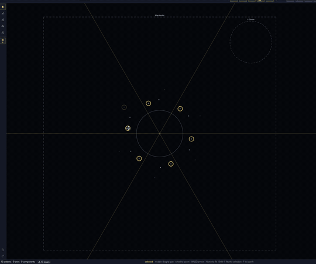
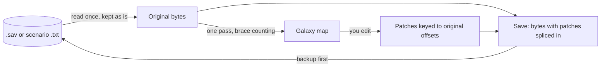

# Stellaris Galaxy Forge

Forge is a desktop editor for the Stellaris galaxy map. It works on save
files and on static galaxy scenarios. It runs outside the game, on
Windows, macOS and Linux.

In a save you can move systems, draw and cut hyperlanes and add new star
systems, then load the save and carry on with the same campaign. A
scenario is a galaxy map that a new game starts from instead of a random
one. Forge can make one from a blank map or from any save, and the Paint
a Galaxy mod lets you start a new game on it.

- Download: [the latest release](https://github.com/IanHeinrich/stellaris-galaxy-forge/releases/latest)
- How to use it: [the user guide](docs/user-guide.md)
- On the Steam Workshop: [Galaxy Forge](https://steamcommunity.com/sharedfiles/filedetails/?id=3805578137).
  The item has no mod content, so subscribing installs nothing. It's
  there so people can find the editor.


## Editing a save


Open a `.sav`, change the map, save, then load it in Stellaris. You can:

- Move systems. Their hyperlanes come with them and the lane lengths are
  updated.
- Draw and cut hyperlanes one at a time, or in broad strokes with the
  Connect and Cut brushes. Join links separate islands of systems back
  into one galaxy.
- Add a star system in empty space. Forge rolls it from your install's
  own rules, with its star, planets, moons, asteroid belts and deposits,
  at the save's resource abundance. Until you reopen the file you can
  roll it again, pick its star or rename it.
- Add one of the game's unique systems, such as Zevox, or a special one
  such as Trappist, from the same menu.
- Delete systems you added, one at a time or a whole selection. Systems
  the save already had stay.
- Change a star's type and size, or give a selection of systems one star
  class.
- Add, move, resize, rename and remove nebulae. A new nebula takes a name
  from the game's own list. Systems inside a nebula you add, move or
  resize get its cloud and hide ships, as they do in the game's own
  nebulae.
- Make a nebula turbulent or calm with the checkbox on its page.
- On a Stellaris 4.5 save, pick an empire's border and fill colours.
- See which L-Gate outcome the save rolled, and change it until a gate
  opens.

The user guide's [Edit a save](docs/user-guide.md#edit-a-save) and
[Add a system](docs/user-guide.md#add-a-system) have the menus and keys
for each of these.

## Making a scenario


A scenario can start from a blank map, from a day-one save for the
game's own layout, or from any save. A save opened as a scenario keeps
its layout, names and fallen empires, and the save itself is left alone.

Systems, hyperlanes and nebulae are edited as in a save. In a scenario
you can also:

- Add systems by right-clicking.
- Choose what each system spawns in the initializer browser. It lists
  every initializer your install and mods define, and shows what each
  one places before you pick it.
- Set spawn points and their weights, and bar lanes the game must never
  draw.
- Place marauder clans. On a map for Paint a Galaxy you can also place
  fallen empire zones and wormhole pairs, and set what kind of empire
  each seat takes.
- Set the counts the new-game screen offers, such as the number of AI
  empires.

The steps are in [Make a scenario](docs/user-guide.md#make-a-scenario).

## Painting and symmetry



In a scenario, the Paint brush scatters clusters of systems and joins
them up with lanes, at a size and density you set, and the Erase brush
takes them out. With symmetry on, every system, lane and stroke is
mirrored about the galaxy centre or repeated 2 to 8 times around it.

## Playing a scenario

All you need to play a Forge scenario is the
[Paint a Galaxy](https://steamcommunity.com/sharedfiles/filedetails/?id=3532904115)
mod on the Steam Workshop, plus its
[Reserved Spawns submod](https://steamcommunity.com/sharedfiles/filedetails/?id=3762808682) if your map reserves seats. When Stellaris starts a new game on a galaxy drawn by hand,
it gets several things wrong: empires land on the wrong homeworlds, and
marauders and fallen empires don't appear. Oatmeal Problem worked out
why and fixed it in that mod, and Forge's scenarios rely on that work.
Forge writes scenarios in the mod's format unless you untick the box for
it.

When the map is ready, save it into the mod from the File menu, enable
the mod in your playset and start a new game. Your map is listed as a
galaxy size. Steam can replace the mod's folder when the mod updates, so
keep a copy of your map somewhere else too.
[Play your scenario](docs/user-guide.md#play-your-scenario) covers seats,
what happens on day one and the mod's own limits.

You don't need the mod to edit a save.

## What you can see

<p>
  
  
</p>

Click a system and the inspector shows its position, its lanes with the
length the game uses next to the real distance, bypasses, planets,
fleets, flags and initializer. In a save, the planet list shows how far
out each body orbits.

Every planet, moon, star and asteroid in a save has its own page. It
shows the body's deposits in the game's art with what each one gives,
its blockers and what clearing them costs, and its modifiers and moons.
An owned planet's page also sums up its colony.

In a scenario, the inspector shows what a system will spawn before the
game is ever started. The Scripts tab lists the initializer and the
events and effects that reach a system, with the file and line each one
comes from. That list is a best guess (see [Limits](#limits)).

Search (F) finds systems, empires, planets, fleets and nebulae, and
systems by what they hold, such as "gaia" or "leviathan". Pin a search
and its systems stay ringed on every save you open.

<p>
  
  
</p>

The map draws each system's planets, stations and resources as you zoom
in, with the art and names from your own install. The Layers menu
switches each layer on and off, and the main ones have a number key.
[Get around the map](docs/user-guide.md#get-around-the-map) has the keys.

## What Forge can change and what it only shows

| | In a save | In a scenario |
|---|---|---|
| System positions | editable | editable |
| Hyperlanes: add, cut, isolate | editable | editable |
| Lane lengths | editable | not in the file |
| Systems: add, rename, remove | add, then reroll, rename or delete the ones you added until you reopen the file | editable |
| The game's unique and special systems | add | set as a system's initializer |
| Stars: type and size | editable | from the initializer |
| Which initializer a system uses | shown | editable |
| The initializer itself (its star, planets, resources) | shown | shown, never written: initializers belong to the game and mod files |
| Planets and moons | shown, each on its own page | shown, from the initializer |
| Deposits | shown, and rolled for the systems you add. The `sgf` tool adds or removes them on uncolonised planets | shown, from the initializer |
| Colonies | shown, with their pops | shown, from the initializer |
| Nebulae: add, move, resize, rename, remove | editable | editable |
| Turbulent nebulae | editable | not in the file |
| Empire border and fill colours | editable on 4.5 saves | not in the file |
| L-Gate outcome | editable | not in the file |
| Spawn points, weights, seat kinds | not in the file | editable |
| Marauder clans | shown | editable |
| Fallen empire zones, wormhole pairs | fallen empires and wormholes shown | editable on a map for Paint a Galaxy |
| Prevented lanes, header keys, new-game counts | not in the file | editable |
| Fleets, starbases, waystations | shown | not in the file |
| Empires and territories | shown | shown, from scripts, best guess |
| Bypasses: wormholes, gateways, L-Gates | shown | shown, from initializers and scripts, best guess |
| Flags | shown | shown |
| Techs, leaders, diplomacy | not shown | not in the file |

## Keeping your save safe

- Forge edits the file as bytes. Only the statements you changed differ.
  Everything else, including anything from mods or a newer game version
  that Forge doesn't understand, is copied out byte for byte. A load then
  save with no edits gives a byte-identical scenario, or a save whose
  `gamestate` and `meta` are byte-identical. The zip around them is
  written fresh.
- Every save leaves the previous file beside it as a timestamped backup,
  up to eight per file. The first backup is the file you opened.
- If Stellaris saved over the file after you opened it, Save asks before
  replacing it.
- Every edit can be undone, and the Changes tab lists them all.
- The Issues tab flags the problems Forge knows to look for before you
  save, such as a lane listed at one end only or a system cut off from
  the rest. It isn't the game. Loading the save in Stellaris is the final
  check.

[Save and back up](docs/user-guide.md#save-and-back-up) says how to put
the original back.

## Limits

It's a beta. Only the galaxy map can be edited. Empires, fleets and
colonies are shown where the file has them, but can't be changed.

Forge works on Stellaris 4.x saves. I've checked the edits in-game on
4.4.6 and 4.5.0, with all DLC and no mods. Hyperlane edits also work on
saves from 3.4 to 3.9. Adding systems needs a 4.x save, and I've
checked it in-game on 4.5.0.

Ironman saves aren't supported. Adding systems is turned off for them,
and I haven't tested the other edits on one.

With Steam Cloud on, Steam can put its cloud copy back over an edited
save. Close Steam or turn Steam Cloud off for Stellaris before you play
one. See [Steam Cloud saves](docs/user-guide.md#steam-cloud-saves).

Nothing from the game is bundled. Forge reads the game's definitions,
names and art from your own install and your enabled mods when it runs.
Modded systems show with their own names and art, and systems you add
are rolled from the same files. Without an install the map draws plain
stars and generated names, and you can't add systems to a save.

Scenario editing is newer than save editing and has had less use. I've
checked it in-game on the same two versions, on the maps of a few large
mods and on saves exported as scenarios.

Anything Forge reads from scripts and events is a best guess. It follows
initializers, star flags and event targets. It can't follow scripts that
iterate over classes of systems or address them by name, and it reads
conditions as if they were true.

The macOS build isn't signed.

### After a game update

Moving systems and editing lanes and nebulae touch only the galaxy
statements in the save (`galactic_object`, `hyperlane`, `nebula`) and its
brace structure. Those have stayed the same across Stellaris versions,
so I don't expect an update to break those edits. Adding systems and
editing stars, planets and empire colours reach further into the save.
Those are the edits most likely to need a fix after an update. The
layers drawn from your install can break too: star and planet art,
localised names, special-system detection and script reading. When they
do, the map falls back to plain stars and generated names. Anything
Forge doesn't understand is copied through as it was.

## Scope

A save is a game in progress, and a wrong byte in the wrong place can do
strange things to it. I add a new kind of edit once I understand it
against the game's own behaviour. It also has to be checked in-game,
undoable, and finished in the app before it ships.

Reading a save or a scenario carries no risk, so I add to what the
editor shows more readily. Seeing planets, fleets, ownership and what a
script will do on day one helps you make better edits. Expect the
inspector and the map layers to get ahead of what can be changed.

How far editing goes depends on two things. One is how well the current
model holds up across game updates. The less it costs to keep working,
the more room there is to extend it. The other is what people ask for.

## Bugs and requests

Open an issue on
[GitHub](https://github.com/IanHeinrich/stellaris-galaxy-forge/issues).
[CONTRIBUTING.md](CONTRIBUTING.md) says what helps in a report. If you
don't have a GitHub account, leave a comment on the
[Workshop page](https://steamcommunity.com/sharedfiles/filedetails/?id=3805578137)
instead. If you can attach the save or scenario file it happened on,
that helps a lot.

## Installing

Download the latest release from
[the Releases page](https://github.com/IanHeinrich/stellaris-galaxy-forge/releases).

- Windows: `Stellaris-Galaxy-Forge-<x.y.z>-Windows-Installer.exe`. It is
  signed by "Open Source Developer, Ian Heinrich". While the certificate
  is new, Windows SmartScreen may still warn before it runs. Click "More
  info", then "Run anyway". There is also an MSI for managed installs.
- Windows, without installing:
  `Stellaris-Galaxy-Forge-<x.y.z>-Windows-No-Install.zip`. Unzip it and
  run the app inside. It needs the WebView2 runtime, which Windows 11
  already has.
- Mac: `Stellaris-Galaxy-Forge-<x.y.z>-Mac.dmg`, for Intel and Apple
  silicon Macs. It is not signed, so Gatekeeper will refuse to open it
  until you run `xattr -cr "/Applications/Stellaris Galaxy Forge.app"`,
  or right-click the app and choose Open.
- Linux: `Stellaris-Galaxy-Forge-<x.y.z>-Linux.AppImage`, which needs
  `chmod +x` before it will run, or the `Linux-Debian-Ubuntu.deb` or
  `Linux-Fedora.rpm` package. All are built on Ubuntu 22.04, x86_64.

The app checks for a newer release when it starts and shows a badge when
it finds one. The Help menu can turn the check off or run it
straight away. The Windows installer or MSI, the Linux AppImage and the Mac app
install the update themselves and restart. The no-install zip and the
`.deb` and `.rpm` packages send you to the Releases page instead. Every
update is verified against the project's public key before it is
applied. The SmartScreen warning above applies to the downloaded
installer too.

`SHA256SUMS` in the release lists a checksum for every file, so you can
verify a download before running it.

Once it's installed, the user guide's
[Quick start](docs/user-guide.md#quick-start) takes you from opening a
save to loading it in the game.

## Command line

The `sgf` binary does the same edits from a terminal, one command per
edit, with the same backup the app makes. It is on the Releases page
beside the app. The commands are listed in the
[user guide](docs/user-guide.md#command-line).

## How it works

The file is never rebuilt. When you open a save or a scenario, its bytes
are read once and kept exactly as they are. One pass over the text
records where every statement starts and ends by counting braces, and
from that the galaxy map is drawn. Nothing is parsed into a model of the
whole file, so nothing the editor does not understand can be lost or
reordered.

When you make an edit, only the statements that edit touches are
rewritten or added: a moved system's coordinates, a lane's two entries,
a nebula's member list, a new system and its planets. The new bytes are
kept in a patch list, keyed to where the old bytes sat in the original
file. Every edit records how to undo itself, so undo and redo are edits
too. Saving writes the original bytes out again into a new file, with
the patches spliced in at their offsets. It then renames the old file to
a backup and moves the new one into place. Open and save with nothing
changed and the output is byte-for-byte the input.



The full picture, with what the editor holds in memory and how the
pieces relate, is in [docs/architecture.md](docs/architecture.md).

## Building from source

Prerequisites:

- Rust, stable, via [rustup](https://rustup.rs).
- Node 22.
- The [Tauri 2 prerequisites](https://v2.tauri.app/start/prerequisites/)
  for your platform. On Windows that is the Visual Studio C++ build tools
  and the WebView2 runtime, which Windows 11 already has. On Ubuntu the
  packages CI installs are `libwebkit2gtk-4.1-dev libappindicator3-dev
  librsvg2-dev patchelf` (see `.github/workflows/ci.yml`).

Then:

```
git clone https://github.com/IanHeinrich/stellaris-galaxy-forge
cd stellaris-galaxy-forge
git lfs install          # the sample saves in testdata/ are stored with Git LFS
cd app
npm install
npm run tauri dev        # builds the Rust core and opens the app
```

The first build compiles the Rust core and takes a few minutes. Later
starts are quick. `git lfs install` is only needed for the sample saves
the tests use, not to run the app. To make an installer for your
platform instead, run `npm run tauri build` in `app/`. The bundles land
under `target/release/bundle/` at the repository root.

## Contributing

Bug reports, feature requests and pull requests are welcome.
[CONTRIBUTING.md](CONTRIBUTING.md) says what to include in each. Read
[docs/engineering-rules.md](docs/engineering-rules.md) before changing
code. It states the non-negotiables, the layout and how this project
tests. The rest of the reference is in `docs/`:

- [docs/architecture.md](docs/architecture.md): how the core, the shell
  and the UI fit together.
- [docs/format-notes.md](docs/format-notes.md): the measured facts about
  the save and scenario formats.
- [docs/game-data-notes.md](docs/game-data-notes.md): how the install
  and its mods are read.
- [docs/adr/](docs/adr/): the decisions behind the architecture.

Run the checks before you push:

```
cargo test --workspace
cargo clippy --workspace --all-targets -- -D warnings
cargo fmt --all
cd app && npm test && npm run lint && npm run build
```

Every pull request adds an entry to `CHANGELOG.md` under `## [Unreleased]`
or carries the `skip-changelog` label. The pull request template lists the
in-game checks that go with a change to the galaxy.

## Acknowledgements

- Oatmeal Problem, for the
  [Paint a Galaxy](https://steamcommunity.com/sharedfiles/filedetails/?id=3532904115)
  mod. Everything Forge writes for a playable scenario, from the seat
  scripts to the fallen empire zones and wormhole pairs, is in the mod's
  format, and its scripts were the reference for how they behave.
- The facts about the save format and the install were measured from the
  game's own files. For the edge cases of how mods layer over the install
  (load order, `replace_path`) and of the script dialect,
  [Irony Mod Manager](https://github.com/bcssov/IronyModManager),
  [CWTools](https://github.com/cwtools/cwtools) and
  [jomini](https://github.com/rakaly/jomini) were the references checked
  against. No code from any of them is used.
- The libraries doing most of the work in the app:
  [Tauri](https://tauri.app), [React](https://react.dev),
  [PixiJS](https://pixijs.com),
  [Zustand](https://github.com/pmndrs/zustand) and
  [Delaunator](https://github.com/mapbox/delaunator). In the tests,
  [insta](https://insta.rs) and
  [proptest](https://proptest-rs.github.io/proptest/).

Stellaris is a Paradox Interactive title. This project is not affiliated
with or endorsed by Paradox.
