# Stellaris Galaxy Forge

A desktop editor for the Stellaris galaxy map for both **static scenarios** and **save files**. In a `.sav` file you can
move systems, add and cut hyperlanes, and add, resize and remove nebulae,
then carry on playing the campaign; in a static galaxy scenario script
(`map/setup_scenarios/*.txt`, the file a new campaign's galaxy can be
generated from) you can do all of that plus add, name and remove systems,
choose what each one spawns by setting its initializer, set spawn points
and weights, bar lanes the generator must not draw, and edit the header,
so a new campaign starts from a galaxy drawn by hand.

## Limitations

Beta. Only the galaxy map is editable today: empires, pops, fleets
and techs are not. Save editing is currently the better tested half: it is checked
in-game on Stellaris 4.4 saves (4.4.6, all DLC, no mods), and Ironman
saves have not been tested. Scenario editing has been checked in-game on
the maps of a few large mods and on saves exported as scenarios, but it is
newer and has had less use. Anything the editor reads from scripts and events is a best guess: it follows
initializers, star flags and event targets, cannot follow scripts that
iterate over classes of systems or address them by name, and reads
conditions as if they were true. macOS builds are published unsigned.

What the editor can change vs what it only shows:

| | In a save | In a scenario |
|---|---|---|
| System positions | editable | editable |
| Hyperlanes: add, cut, isolate | editable | editable |
| Lane lengths | editable | not in the file |
| Nebulae: add, move, resize, rename, remove | editable | editable |
| Systems: add, remove, rename | shown | editable |
| Which initializer a system uses | shown | editable |
| The initializer itself (its star, planets, resources) | shown | shown, never written: initializers belong to the game and mod files |
| Spawn points, weights, reservations | not in the file | editable |
| Prevented lanes, header keys | not in the file | editable |
| Planets, deposits, colonies | shown | shown, from the initializer |
| Fleets, starbases, waystations | shown | not in the file |
| Empires and territories | shown | shown, from scripts, best guess |
| Bypasses: wormholes, gateways, L-Gates | shown | shown, from initializers and scripts, best guess |
| Flags | shown | shown |
| Pops, techs, leaders, ships, diplomacy | not shown | not in the file |

A game update is unlikely to break the editing itself. The galaxy editing
depends only on the text form of the galaxy statements in the save
(`galactic_object`, `hyperlane`, `nebula`) and on brace structure, both of
which have been stable across Stellaris versions, and anything the editor
does not understand is copied through untouched. What an update is most
likely to break is the layers drawn on top of the map from your install:
star and planet art, localised names, special-system detection, script
reading and initializer details. Those fall back to the procedural stars
and generated names rather than corrupting anything.

## Safeguards

- The file is edited as bytes. Only the statements you changed differ;
  everything else, including anything from mods or a newer game version
  the editor does not understand, is copied out byte for byte. A load
  then save with no edits is byte-identical.
- Every save leaves the previous file beside it as a timestamped backup.
- Every edit is undoable and listed in a change log.
- A validator flags anything the game could not cope with, before you
  save.


## In a save

<p>
  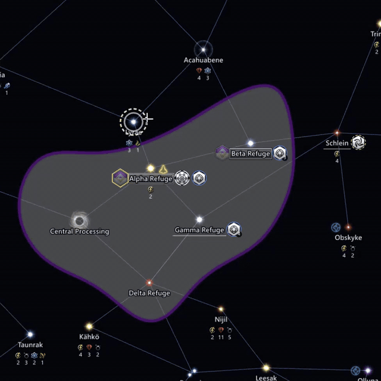
  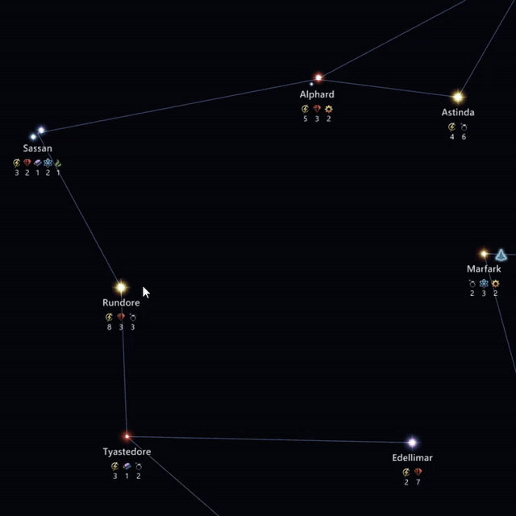
  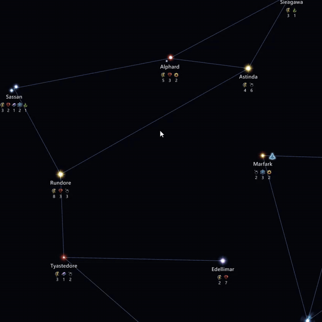
  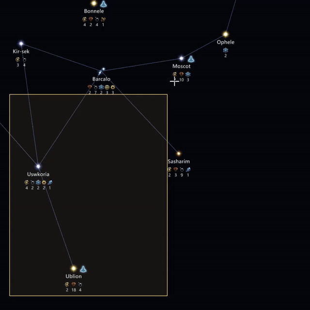
</p>

Move a system and its lanes come with it; draw a lane by dragging from
the ring that appears around a star when you zoom in; cut a lane at its
midpoint; select a cluster and connect it as a mesh or cut every lane
between its members. Nebulae are dragged by their ring and resized by
the handles that appear on it when one is selected.

<p>
  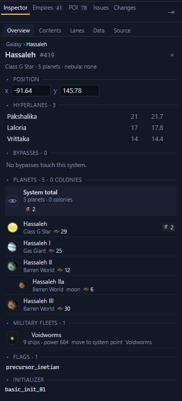
  
  
</p>

The inspector shows everything the save holds about the selected system,
and the map draws each system's planets, stations and resources as you
zoom in, with the art and names from your own install. The Layers menu
switches each drawn layer on and off, with a number key for the main ones.

## In a scenario

<p>
  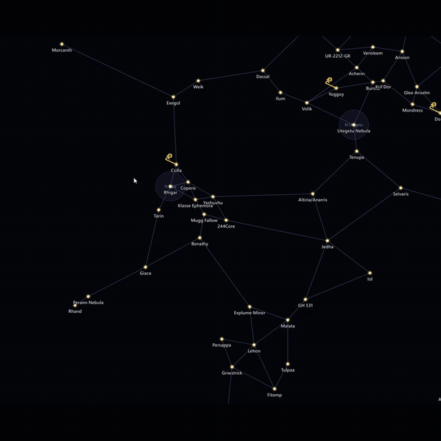
  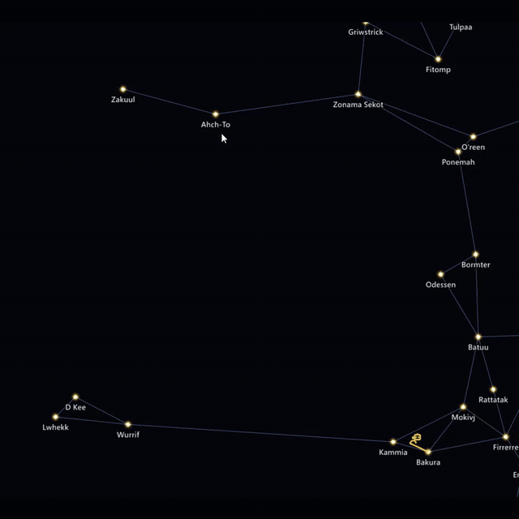
  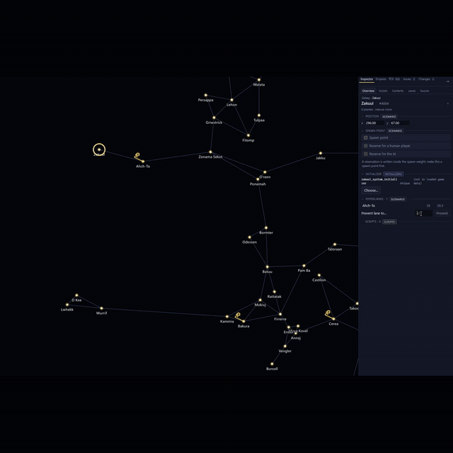
  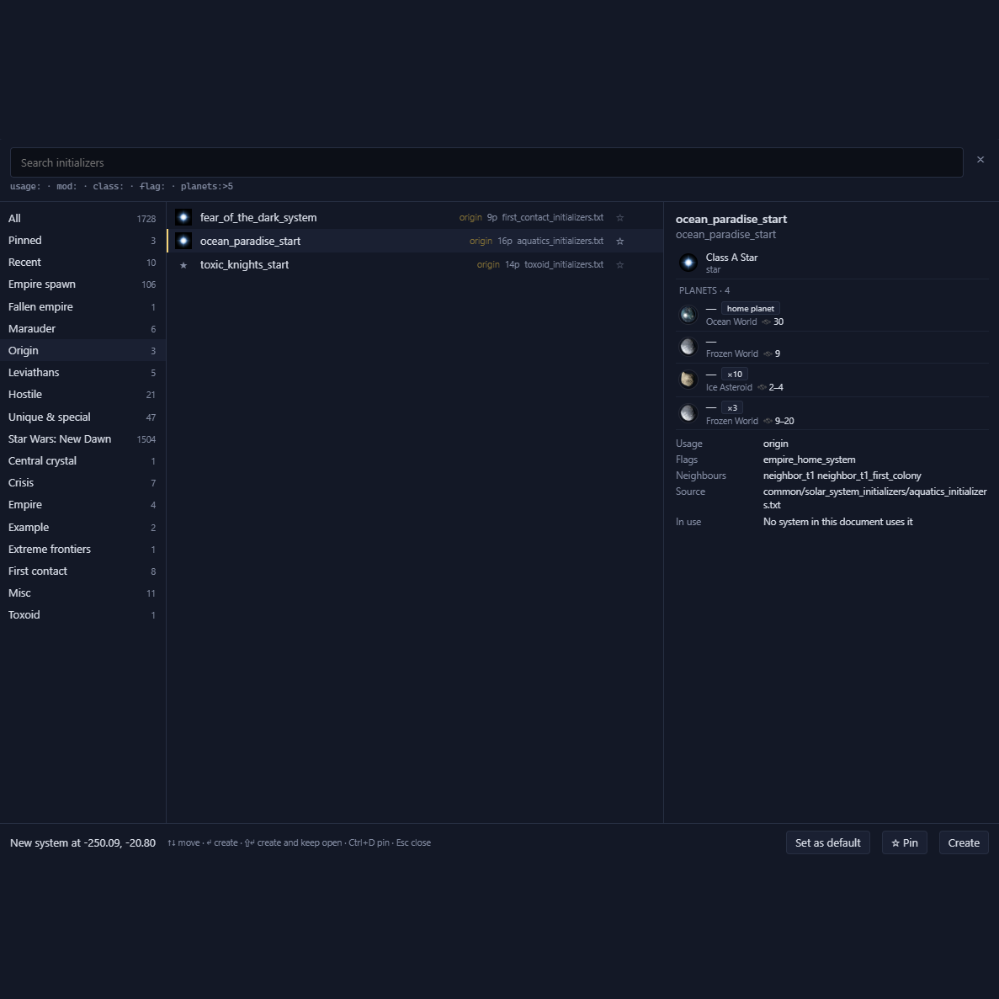
</p>

Right-click empty space to add a system; pick what it spawns from the
initializer browser, which lists everything your install and mods
define; mark spawn points and hold them for a human player or the AI;
bar a lane the generator must never draw. A save can be opened as a
scenario, and an empty scenario, one drawn in Paint a Galaxy inside
Forge, or one from a Paint a Galaxy export can be started from the New
scenario dialog. A scenario can also be written for the Paint a Galaxy
mod.

<p>
  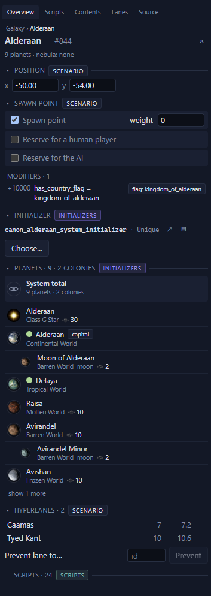
  
</p>

The inspector shows what a scenario system will spawn before the game is
ever started, and the Scripts tab lists the initializer, events and
effects that reach it, with the file and line each comes from. That list
is a best guess (see Limitations).

## Scope

Editing grows slowly and carefully. A save is a game in progress, and a
wrong byte in the wrong place can do strange things to it, so each new
kind of edit arrives only when it can be done properly: understood
against the game's own behaviour, checked in-game, undoable, and finished
in the app rather than half-exposed.

Showing grows freely. Reading a save or a scenario carries no risk, and
the more of it you can see (planets, fleets, ownership, what a script will
do on day one), the better informed the edits you do make. Expect the
inspector and the map layers to get ahead of what can be changed.

Two things decide how far editing goes. First, how well the current model
holds up across game updates: the less it costs to keep working, the more
room there is to extend it. Second, what people ask for.

## Installing

Download the latest release from
[the Releases page](https://github.com/IanHeinrich/stellaris-galaxy-forge/releases).

- Windows: the NSIS installer,
  `Stellaris.Galaxy.Forge_<x.y.z>_x64-setup.exe`, or the MSI. Windows
  SmartScreen will warn that the app is unsigned; click "More info", then
  "Run anyway".
- Windows, no installer: the portable zip,
  `stellaris-galaxy-forge-v<x.y.z>-windows-x86_64-portable.zip`. It needs
  the WebView2 runtime, which Windows 11 already has.
- Linux: the `.AppImage`, `.deb` or `.rpm` for your distribution (all
  built on Ubuntu 22.04, x86_64). The AppImage needs `chmod +x` before it
  will run.
- macOS: the universal `.dmg`. It is not signed, so Gatekeeper will
  refuse to open it until you run
  `xattr -cr "/Applications/Stellaris Galaxy Forge.app"`, or right-click
  the app and choose Open.
- Command line only: `sgf-v<x.y.z>-windows-x86_64.zip`,
  `sgf-v<x.y.z>-linux-x86_64.tar.gz` or
  `sgf-v<x.y.z>-macos-universal.tar.gz`.

`SHA256SUMS` in the release lists a checksum for every file, so you can
verify a download before running it.

## Building from source

Prerequisites:

- Rust, stable, via [rustup](https://rustup.rs).
- Node 22.
- The [Tauri 2 prerequisites](https://v2.tauri.app/start/prerequisites/)
  for your platform. On Windows that is the Visual Studio C++ build tools
  and the WebView2 runtime, which Windows 11 already has. On Ubuntu the
  packages CI installs are `libwebkit2gtk-4.1-dev libappindicator3-dev
  librsvg2-dev patchelf` (see `.github/workflows/ci.yml`).

Then:

```
git clone https://github.com/IanHeinrich/stellaris-galaxy-forge
cd stellaris-galaxy-forge
git lfs install          # the sample save in testdata/ is stored with Git LFS
cd app
npm install
npm run tauri dev        # builds the Rust core and opens the app
```

The first build compiles the Rust core and takes a few minutes; later
starts are quick. `git lfs install` is only needed for the sample save the
tests use, not to run the app. To make an installer for your platform
instead, run `npm run tauri build` in `app/`; the bundles land under
`target/release/bundle/` at the repository root.

## Getting started

Start the app. It opens on a list of what it found on this machine, so
pick a save from it: the rows carry the empire, the in-game date and the
game version. The galaxy fills the window; hold the middle mouse button
and drag to pan, or use W A S D, and use the wheel to zoom.

Drag a star to a new position and let go. Zoom in on it until a ring
appears around it, then drag from that ring to another system to draw a
lane. Ctrl+Z takes either edit back. Ctrl+S writes the save, and the
status bar names the backup it left beside it.

Everything else is in the [user guide](docs/user-guide.md).

## How it works

The file is never rebuilt. When you open a save or a scenario, its bytes
are read once and kept exactly as they are. One pass over the text records
where every statement starts and ends (by counting braces, never
indentation), and from that the galaxy map is drawn. Nothing is parsed
into a model of the whole file, so nothing the editor does not understand
can be lost or reordered.

When you make an edit, only the statements that edit touches are
rewritten: a moved system's coordinates, a lane's two entries, a nebula's
member list. The new bytes are kept in a patch list, keyed to where the
old bytes sat in the original file. Every edit records how to undo itself,
so undo and redo are edits too. Saving writes the original bytes out again
with the patches spliced in at their offsets, into a new file, then renames
the old file to a backup and moves the new one into place. Open and save
with nothing changed and the output is byte-for-byte the input.

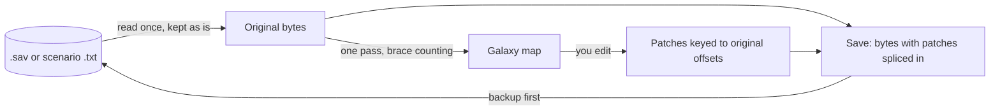

Game definitions, localisation and textures are read from your own
Stellaris install and its active mods when the app runs; nothing from the
game is bundled. The full picture, with what the editor holds in memory
and how the pieces relate, is in [docs/architecture.md](docs/architecture.md).
The rules every change follows are in
[docs/engineering-rules.md](docs/engineering-rules.md), and the measured
facts about the file format are in
[docs/format-notes.md](docs/format-notes.md).

## Command line

The `sgf` binary does the same edits from a terminal, one command per
edit, with the same backup the app makes. The full list is in the
[user guide](docs/user-guide.md#command-line).

## Contributing

Bug reports, feature requests and pull requests are welcome;
[CONTRIBUTING.md](CONTRIBUTING.md) says what to include in each. Read
[docs/engineering-rules.md](docs/engineering-rules.md) before changing
code; it states the non-negotiables, the layout and how this project
tests.

```
cargo test --workspace
cargo clippy --workspace --all-targets -- -D warnings
cargo fmt --all
cd app && npm test && npm run lint && npm run build
```

Every pull request adds an entry to `CHANGELOG.md` under `## [Unreleased]`
or carries the `skip-changelog` label. The pull request template lists the
in-game checks that go with a change to the galaxy.

## Acknowledgements

- [paint-a-galaxy](https://github.com/oatmealproblem/paint-a-galaxy) by
  Oatmeal Problem (MIT): a browser tool for drawing a galaxy and exporting
  it as a static galaxy scenario. The New scenario dialog links to it and
  opens its export. Reading its source confirmed two facts this editor
  relies on: which way a scenario's `position` runs, and that the game
  assigns initializers in the order the `system` statements are listed.
- The facts about the save format and the install were measured from the
  game's own files. For the edge cases of how mods layer over the install
  (load order, `replace_path`) and of the script dialect,
  [Irony Mod Manager](https://github.com/bcssov/IronyModManager),
  [CWTools](https://github.com/cwtools/cwtools) and
  [jomini](https://github.com/rakaly/jomini) were the references checked
  against. No code from any of them is used.
- The libraries doing most of the work: [Tauri](https://tauri.app),
  [React](https://react.dev), [PixiJS](https://pixijs.com),
  [Zustand](https://github.com/pmndrs/zustand) and
  [Delaunator](https://github.com/mapbox/delaunator) in the app;
  [insta](https://insta.rs) and [proptest](https://proptest-rs.github.io/proptest/)
  in the tests.

Nothing from the game is bundled. Stellaris is a Paradox Interactive
title; this project is not affiliated with or endorsed by Paradox.
