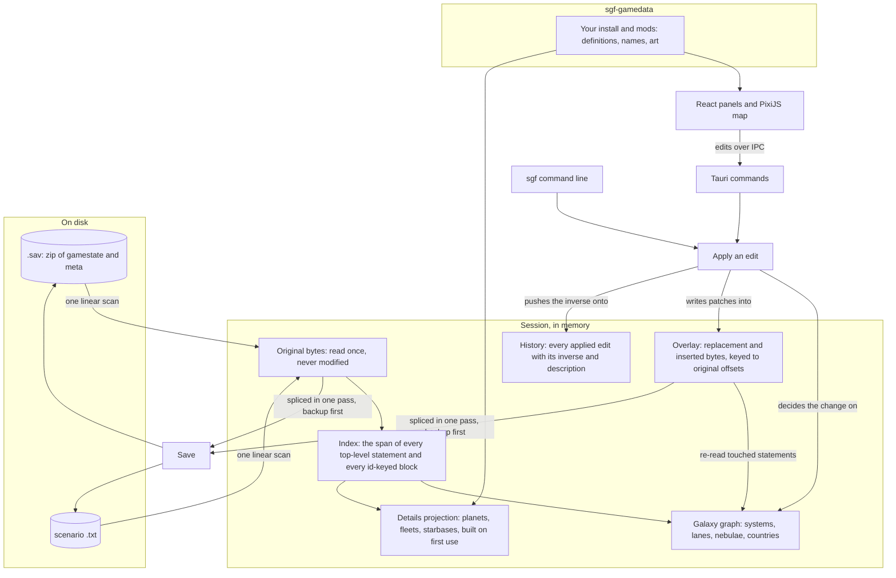

# Architecture

How Stellaris Galaxy Forge holds a document in memory and how an edit
travels from the map to the file. The README has the short version; the
rules every change follows are in [engineering-rules.md](engineering-rules.md).

## Where things live

```
stellaris-galaxy-forge/
├── Cargo.toml                 workspace: crates/* and app/src-tauri
├── VERSION                    the one version; scripts/version.sh copies it into the manifests
├── CHANGELOG.md               Keep a Changelog; every PR adds to Unreleased
├── crates/
│   ├── sgf-core/              the document model; knows nothing about a UI
│   │   ├── src/
│   │   │   ├── archive.rs     the .sav zip: inflate gamestate and meta, backup-then-persist on write
│   │   │   ├── document.rs    a loaded document: original bytes, index, overlay; sniffs save vs scenario
│   │   │   ├── scan.rs        the one-pass index: spans of every statement and id-keyed block
│   │   │   ├── lexer.rs       tokens: bare and quoted scalars, braces, equals
│   │   │   ├── cst.rs         a concrete syntax tree for the statements an edit has to read
│   │   │   ├── span.rs        byte ranges
│   │   │   ├── overlay.rs     patches keyed to original offsets: replace a span or insert at one
│   │   │   ├── emit/          writes the bytes of an edited statement, copying its indentation
│   │   │   ├── format/        the Format trait; save/ and scenario/ are the only per-format code
│   │   │   ├── ops/           every edit: the Op enum, its inverse, description and rules
│   │   │   ├── projections/   caches read from the index: the galaxy graph, names, details
│   │   │   ├── session.rs     document + graph + history; apply, undo, redo, save
│   │   │   ├── validate.rs    what the game could not cope with, errors and warnings
│   │   │   ├── search.rs      find systems and entities by name or id
│   │   │   ├── entity/        addressing any entity in the file for the inspector
│   │   │   ├── library.rs     small registers read from the save: colours, bypasses, ship sizes
│   │   │   ├── export.rs      a save's galaxy written out as a scenario script
│   │   │   ├── synth.rs       synthetic saves for stress tests
│   │   │   ├── keys.rs        the statement keys the formats read
│   │   │   └── views.rs       the IPC types; ts-rs exports them to app/src/generated
│   │   └── tests/             outside-in: every op applied to the sample save, insta snapshots,
│   │                          round-trip identity, corpus timing (SGF_CORPUS_DIR)
│   ├── sgf-gamedata/          the user's install and mods, read at runtime
│   │   ├── src/
│   │   │   ├── install/       Steam discovery, mods, load order, override semantics
│   │   │   ├── registries/    star and planet classes, colours, deposits, ship sizes, gfx
│   │   │   ├── loc/           localisation files, language-keyed names
│   │   │   ├── textures/      DDS decoding and the sprite cache
│   │   │   ├── initializers.rs solar_system_initializers: what a system will spawn
│   │   │   ├── scripts/       events, effects, on_actions: who claims what on day one
│   │   │   ├── special.rs     leviathans, enclaves, marauders, fallen empires, landmarks
│   │   │   ├── details.rs     planet, fleet and starbase readers for the inspector
│   │   │   ├── resolver.rs    @variable expansion
│   │   │   ├── reload.rs      the file watcher: a changed file rebuilds its registry
│   │   │   └── views.rs       IPC types
│   │   └── tests/             against a fixture mod in tests/fixtures, and the real install when present
│   └── sgf-cli/               the sgf binary: cli.rs declares it, commands/ one file per verb
├── app/
│   ├── src-tauri/             the Tauri 2 shell (sgf-app)
│   │   ├── src/commands/      the IPC surface: session, scenario, entity, gamedata, listing
│   │   ├── src/state.rs       the open session, game data and texture cache behind mutexes
│   │   ├── src/watch/         watches the open document's folder and the mod folders
│   │   └── tests/             the commands end to end on the sample save
│   └── src/                   React + TypeScript; a layer imports only from the ones below it
│       ├── panels/            the React tree: chrome/ (top bar, dock, status bar), inspector/,
│       │                      browser/ (empires, points of interest, issues, changes),
│       │                      file/ (open screen, New scenario), initializers/, search/, overlays/
│       ├── map/               the PixiJS renderer: Camera, MapController, interaction/, layers/, picking/
│       ├── store/             Zustand stores, one per concern: session, editor, galaxy, game data, ...
│       ├── lib/               pure helpers: geometry/, initializer/, details/, visual/, keys.ts
│       ├── api/               one function per Tauri command
│       └── generated/         ts-rs output; rewritten by cargo test --workspace, never edited
├── docs/                      this file, the user guide, the engineering rules, the format
│                              and game-data facts, adr/, media/
├── scripts/                   version.sh and changelog.sh, used by the workflows
├── testdata/                  the sample save (git-lfs), its scenario export, a grammar fixture
└── .github/                   ci.yml (checks on three OSes), release.yml (tag, build, publish),
                               changelog.yml, the PR template with the in-game checks
```

## The pieces

- **Rust core, `sgf-core`.** Opens a save or a scenario, indexes it, projects
  the galaxy from it, applies edits and writes the file back. It has no
  idea a UI exists.
- **Game data, `sgf-gamedata`.** Reads the user's Stellaris install and
  active mods at runtime: system initializers, star and planet classes,
  localisation, textures, the scripts that place things at game start. A
  file watcher rebuilds the affected registry when a mod file changes.
- **Command line, `sgf`.** The same edits from a terminal, and the test
  harness for the core.
- **Desktop app.** A Tauri 2 shell (`sgf-app`) around a React and
  TypeScript UI with a PixiJS map. The UI never touches bytes: it sends
  edits to the core over IPC and redraws from what comes back.

## What a session holds



**Original bytes.** A save is a zip with two members, `gamestate` and
`meta`; a scenario is a plain text file. Whichever it is, the text is
inflated or read once and held unchanged for the life of the session.

**Index.** One linear pass over the text records the byte span of every
top-level statement and, inside the sections that hold entities, the span
of every id-keyed block. Structure comes from counting braces; the game
writes keys at column 0 at any depth, so indentation means nothing. The
index is the only structure the editor keeps about the file as a whole:
there is no typed model of it and nothing is ever serialised from one.

**Projections.** The galaxy graph is read from the index: systems with
their positions and lanes, nebulae with their members, countries with the
systems they own. The details projection (planets, deposits, fleets,
starbases, archaeological sites) is built the first time something asks
for it. Both are caches: an edit updates or invalidates them, and they are
never written back.

**Overlay.** Every edit writes its replacement bytes into the overlay,
keyed to the offset of the statement it replaces in the original, or, for
a new statement, to the offset it is inserted at plus a sequence number.
One slot per statement; a later edit to the same statement replaces the
slot. The original bytes are never modified.

**History.** Applying an edit records the edit, a description for the
change log, its inverse, and the slot contents it displaced. Undo applies
the inverse; redo applies the edit again.

## An edit, end to end

1. The UI or the CLI sends an edit: move system 419 to (x, y).
2. The core decides what changes on the galaxy graph: the system's
   position, and the stored length of each of its lanes on both ends.
3. The format writes the bytes for each touched statement and puts them in
   the overlay. Emitted text copies the indentation of the statement it
   replaces.
4. The graph re-reads the touched statements so the map and the inspector
   show the new state.
5. The inverse (move it back, restore the lengths) goes onto the history.
6. The validator runs over the graph and reports what the game could not
   cope with.

On save, the core streams the original bytes from start to end, emitting
each overlay slot in place of the original span it replaces (or at its
insertion offset), into a new file beside the old one; the old file is
renamed to `<name>.sav.bak-<stamp>` and the new one moved into place.

## The format seam

A save and a scenario share the byte model, the index, the graph, the
edits and the history. The differences are behind one trait, `Format`:
which statements hold systems, lanes and nebulae; which edits the format
supports (a scenario can add and remove systems and set what they spawn,
a save cannot; a save carries lane lengths, a scenario does not); and how
each edit's bytes are written. Edits decide on the graph; the format
writes the bytes.

## Layers of the app

`app/src` is split by layer, and a layer may only import from the ones
below it: `api/` (one function per Tauri command), `store/` (session state
and the actions the UI calls), `lib/` (pure helpers over the generated
types), `map/` (the PixiJS renderer), `panels/` (the React tree around the
map), and `generated/` (the IPC types ts-rs writes from the Rust crates).
`app/src/lib/README.md` and `app/src/panels/README.md` state the rule and
its exceptions.
