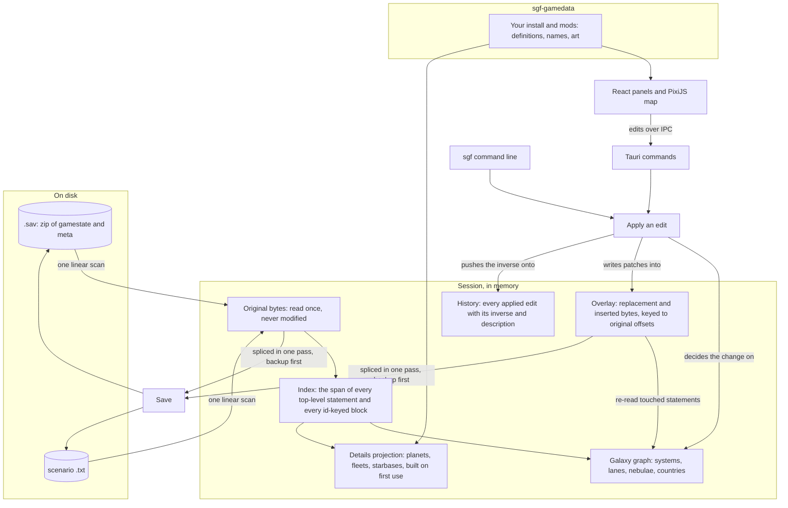

# Architecture

This page explains how Stellaris Galaxy Forge holds a document in memory
and how an edit gets from the map to the file. The README has the short
version. The rules every change follows are in
[engineering-rules.md](engineering-rules.md).

## Where things live

```
stellaris-galaxy-forge/
├── Cargo.toml                 workspace: crates/* and app/src-tauri
├── VERSION                    the version number, which scripts/version.sh copies into the manifests
├── CHANGELOG.md               Keep a Changelog; every PR adds to Unreleased
├── crates/
│   ├── sgf-core/              the document model; knows nothing about a UI
│   │   ├── src/
│   │   │   ├── archive.rs     the .sav zip: inflate gamestate and meta, backup-then-persist on write
│   │   │   ├── backup.rs      the backups beside a saved file, keeping only the original, the three
│   │   │   │                  newest and four spread over the rest
│   │   │   ├── document.rs    a loaded document (original bytes, index, overlay), and whether it is
│   │   │   │                  a save or a scenario
│   │   │   ├── scan.rs        the index, built in one pass: spans of every statement and id-keyed block
│   │   │   ├── lexer.rs       tokens: bare and quoted scalars, braces, equals
│   │   │   ├── cst.rs         a concrete syntax tree for the statements an edit has to read
│   │   │   ├── span.rs        byte ranges
│   │   │   ├── overlay.rs     patches keyed to original offsets: replace a span or insert at one
│   │   │   ├── emit/          writes the bytes of an edited statement, copying its indentation
│   │   │   ├── format/        the Format trait; save/ and scenario/ are the only per-format code.
│   │   │   │                  save/details/ projects a system's planets, fleets and starbase;
│   │   │   │                  save/write/ writes the save ops, with game_tables.rs for what is
│   │   │   │                  copied from the game's own files
│   │   │   ├── ops/           every edit. op.rs has the Op enum, with each op's inverse and
│   │   │   │                  description. plan.rs commits all of an op's edits or none of them.
│   │   │   │                  rules/ decides what an edit may do on the graph. history.rs replays
│   │   │   │                  bytes for undo
│   │   │   ├── projections/   caches read from the index: the galaxy graph and names, and the
│   │   │   │                  readers every projection shares
│   │   │   ├── session.rs     document + graph + history; apply, undo, redo, save
│   │   │   ├── validate/      what the game could not cope with. The codes are here, with paint.rs
│   │   │   │                  and scenario.rs for the checks that apply to only one kind of file
│   │   │   ├── search.rs      find systems and entities by name or id, and systems by what they hold
│   │   │   ├── entity/        addressing any entity in the file for the inspector
│   │   │   ├── library.rs     where this machine keeps its saves, and what each campaign folder
│   │   │   │                  holds, for the Open screen
│   │   │   ├── export/        writes a save's galaxy out as a scenario script, as a draft with a
│   │   │   │                  report. policy.rs decides what carries over. paint/ adds the
│   │   │   │                  Paint a Galaxy profile (header, seats, fallen empire zones)
│   │   │   ├── guides.rs      where the game places things at generation (the L-Cluster circle)
│   │   │   ├── shape.rs       every key path of a gamestate with its count, and the difference
│   │   │   │                  between two
│   │   │   ├── synth.rs       synthetic saves for stress tests
│   │   │   ├── keys.rs        the statement keys the formats read
│   │   │   └── views.rs       the IPC types; ts-rs exports them to app/src/generated
│   │   └── tests/             outside-in: every op applied to the sample saves, insta snapshots,
│   │                          round-trip identity, corpus timing (SGF_CORPUS_DIR), and
│   │                          constants.rs, which writes app/src/generated/constants.ts
│   ├── sgf-gamedata/          the user's install and mods, read at runtime
│   │   ├── src/
│   │   │   ├── install/       Steam discovery, mods (the Paint a Galaxy mod by Workshop id), load
│   │   │   │                  order, override semantics
│   │   │   ├── registries/    star and planet classes, colours, deposits, resources, ship sizes,
│   │   │   │                  starbase levels, country types, bypasses, galaxy sizes and shapes,
│   │   │   │                  defines, gfx
│   │   │   ├── loc/           localisation files, language-keyed names
│   │   │   ├── textures/      DDS decoding and the sprite cache
│   │   │   ├── initializers.rs solar_system_initializers: what a system will spawn
│   │   │   ├── condition.rs   a trigger block compiled once to the conditions the crate can judge
│   │   │   ├── weight.rs      a weight block: a base, its factors and its modifiers
│   │   │   ├── generate.rs    rolls a system to add to a save from the install's rules, with
│   │   │   │                  rng.rs for its random numbers
│   │   │   ├── layouts.rs     the misc_system_init layouts the generator can build
│   │   │   ├── menu.rs        the Special menu of Add system
│   │   │   ├── naming.rs      names for the systems and nebulae the editor places
│   │   │   ├── deposit_roll.rs the deposits a generated body rolls
│   │   │   ├── body_effects.rs what a layout's init_effect does to a body it places
│   │   │   ├── summary.rs     the hover card of an Add system pick
│   │   │   ├── planet_views.rs what the planet page draws from the install
│   │   │   ├── scripts/       events, effects, on_actions: who claims what on day one
│   │   │   ├── special.rs     leviathans, enclaves, marauders, fallen empires, landmarks
│   │   │   ├── details.rs     planet, fleet and starbase readers for the inspector
│   │   │   ├── resolver.rs    gives details and exports the install's definitions when game data
│   │   │   │                  is loaded, and the save's own keys otherwise
│   │   │   ├── reload.rs      rereads only the registry that a changed file under a layer root
│   │   │   │                  belongs to
│   │   │   └── views.rs       IPC types
│   │   └── tests/             against a fixture mod in tests/fixtures, and the real install when present
│   └── sgf-cli/               the sgf binary: cli.rs declares it, commands/ has one file per verb
├── app/
│   ├── src-tauri/             the Tauri 2 shell (sgf-app)
│   │   ├── src/commands/      the IPC surface: session, scenario, entity, gamedata, listing,
│   │   │                      add_system, nebula, paint, update
│   │   ├── src/state.rs       the open session, game data and texture cache behind mutexes
│   │   ├── src/views.rs       the shell's own IPC types, for the updater
│   │   ├── src/watch/         watches the install and mod roots game data was read from
│   │   └── tests/             the commands end to end on the sample save
│   └── src/                   React + TypeScript. A layer imports only from the layers below it
│       ├── test/              builders and stand-ins the tests of every layer share, and ipc.ts,
│       │                      the one set of command spies
│       ├── panels/            the React tree: chrome/ (top bar, dock, status bar), inspector/,
│       │                      browser/ (empires, points of interest, issues, changes),
│       │                      file/ (open screen, New scenario), initializers/, search/, overlays/
│       ├── map/               the PixiJS renderer: Camera, MapController, interaction/ (the Select
│       │                      and brush models), layers/ with highlights/ (the brush, drag and
│       │                      symmetry overlays), picking/ (what lies under the pointer)
│       ├── store/             Zustand stores, one per concern: session, editor, galaxy, game data, ...
│       │                      editorStore.*.ts split the editor's actions by subject (nebulae,
│       │                      lanes, brush, ...). editorEdits.ts runs all edits through a single
│       │                      queue. symmetricEdits.ts widens an edit under symmetry.
│       │                      fileSessionStore.saveGate.ts asks a save's questions, and
│       │                      fileSessionStore.writes.ts writes the files. issueNotes.ts raises
│       │                      the app's own notes. storeFixture.ts resets every store for a
│       │                      test, and fixtures/ holds the documents the tests open
│       ├── lib/               pure helpers: geometry/, initializer/, details/, visual/, brush/, keys.ts
│       ├── api/               one function per Tauri command
│       └── generated/         ts-rs output and constants.ts; rewritten by cargo test --workspace,
│                              never edited
├── docs/                      this file, the user guide, the engineering rules, the format
│                              and game-data facts, the Paint a Galaxy integration notes, adr/,
│                              media/
├── scripts/                   version.sh, changelog.sh and docs-only.sh, used by the workflows, and
│                              game-update.sh for a new game version
├── testdata/                  the 3.4, 4.4 and 4.5 sample saves (git-lfs), the 4.4 save's scenario
│                              and Paint exports, a scenario as Paint a Galaxy writes one, the
│                              Issues fixtures, a grammar fixture and two add-system specs
├── workshop/                  the Steam Workshop page and its uploader (its own Cargo package)
└── .github/                   ci.yml (checks on three OSes), ci-docs.yml (reports those checks as
                               passed for a docs-only change), release.yml (tag, build, publish),
                               changelog.yml, actions/setup, the PR template with the in-game checks
```

## The pieces

- `sgf-core` is the Rust core. It opens a save or a scenario, indexes
  it, projects the galaxy from it, applies edits and writes the file
  back. It has no idea a UI exists.
- `sgf-gamedata` reads the user's Stellaris install and active mods at
  runtime. That covers system initializers, star and planet classes,
  localisation, textures and the scripts that place things at game
  start. When a mod file changes, a file watcher rebuilds the registry
  it affects. It also rolls the systems added to a save from the
  install's own rules.
- `sgf` is the command line. It runs the same edits from a terminal,
  and it is also the test harness for the core.
- The desktop app is a Tauri 2 shell (`sgf-app`) around a React and
  TypeScript UI with a PixiJS map. The UI never touches bytes. It sends
  edits to the core over IPC and redraws from what comes back.

## What a session holds



A save is a zip with two members, `gamestate` and `meta`. A scenario is
a plain text file. The session inflates or reads the text once and keeps
those original bytes unchanged for as long as it is open.

The index comes from one linear pass over the text. It records the byte
span of every top-level statement. Inside the sections that hold
entities, it also records the span of every id-keyed block. Structure
comes from counting braces. The game writes keys at column 0 at any
depth, so indentation means nothing. The index is the only structure
the editor keeps about the file as a whole, apart from two lists read
back from the overlay after every edit: a save's `nebula` sections and
the entities an op added. There is no typed model of the file, and
nothing is ever serialised from one.

The galaxy graph is a projection read from the index. It holds systems
with their positions and lanes, nebulae with their members, and
countries with the systems they own. The details projection covers
planets, deposits, fleets, starbases and archaeological sites. It is
built the first time something asks for it. Both projections are
caches. An edit updates or invalidates them, and they are never written
back.

Every edit writes its replacement bytes into the overlay. A replacement
is keyed to the offset, in the original, of the statement it replaces.
A new statement is keyed to the offset it is inserted at, plus a
sequence number. Each statement has one slot, and a later edit to the
same statement replaces what is in it. The original bytes are never
modified.

When an edit is applied, the history records the edit, a description
for the change log, its inverse, and the slot contents the edit
replaced. Undo puts those old bytes back, and redo puts the edit's bytes
back. The inverse describes the change. A `Batch` applies several edits
as one history entry. If any of them is refused, the document is left as
it was.

## An edit, end to end

1. The UI or the CLI sends an edit: move system 419 to (x, y).
2. The core decides what changes on the galaxy graph. Here that is the
   system's position, and the stored length of each of its lanes on
   both ends.
3. The format writes the bytes for each touched statement and puts them
   in the overlay. Emitted text copies the indentation of the statement
   it replaces.
4. The graph re-reads the touched statements, so the map and the
   inspector show the new state.
5. The inverse (move it back, restore the lengths) goes onto the
   history.
6. The validator runs over the graph and reports what the game could not
   cope with.

On save, the core streams the original bytes from start to end into a
new file beside the old one. Where an overlay slot replaces a span, the
slot's bytes go out instead of the original ones. An inserted statement
goes out at its insertion offset. The old file is then renamed to
`<name>.sav.bak-<stamp>` and the new one is moved into place.

## Ownership

Who owns a system comes from three places. `sgf-core` reads the
structure the text itself carries. In a save, that is the countries and
the systems they hold. In a scenario, it is the marauder roles and
fallen empire zones, read from the initializers and flags the scenario
names. `sgf-gamedata` works out what that text means at game start: the
scripted owners and day-one claims that its initializer chains and
events hand out.

In the app, `composeOwnership` in `lib/ownership.ts` merges the two into
a single owner table. A scenario's marauder clan (a home and the raid
bases hyperlaned to it) becomes one synthetic owner in that table, and
the scripted marauder country behind it is dropped. A single map layer
paints every owner in the table.

## Scenario profiles

A scenario is written for a profile. `Plain` is the game's own static
galaxy script. `PaintAGalaxy` is the same script decorated for Oatmeal
Problem's mod. The export builds a plain draft, and `export/paint`
decorates it with the mod's header, a spawn script on every seat, the
fallen empire zones and the wormhole flags.

Reading a scenario needs no profile. The scenario format picks out the
mod's statements from the bytes (`format/scenario/paint.rs`,
`fe_zone.rs`), so a scenario another tool wrote for the mod is edited
faithfully.

In the app, `lib/paint.ts` decides whether a document is a Paint one. It
goes by the file's content, the choice made when the file was created,
and where the file is. `store/paintModStore.ts` holds the standing
choice and the mod's install state. `sgf-gamedata` finds the mod itself
(`install/mods.rs`).

## The format seam

A save and a scenario share the byte model, the index, the graph, the
edits and the history. What differs between them is behind the `Format`
trait. It says which statements hold systems, lanes and nebulae, which
edits the format supports, and how each edit's bytes are written. A
scenario can add and remove any system and set what it spawns. A save
can add systems and remove the ones added this session. A save carries
lane lengths, and a scenario does not. An edit decides what changes on
the graph, and the format writes the bytes.

## Layers of the app

`app/src` is split by layer. From the bottom up, the layers are
`generated/` (the IPC types ts-rs writes from the Rust crates), `api/`
(one function per Tauri command), `lib/` (pure helpers over the
generated types), `store/` (session state and the actions the UI calls),
`map/` (the PixiJS renderer) and `panels/` (the React tree around the
map). A layer imports only from the layers below it.
`app/src/lib/README.md` and `app/src/panels/README.md` state the rule
and its exceptions.
