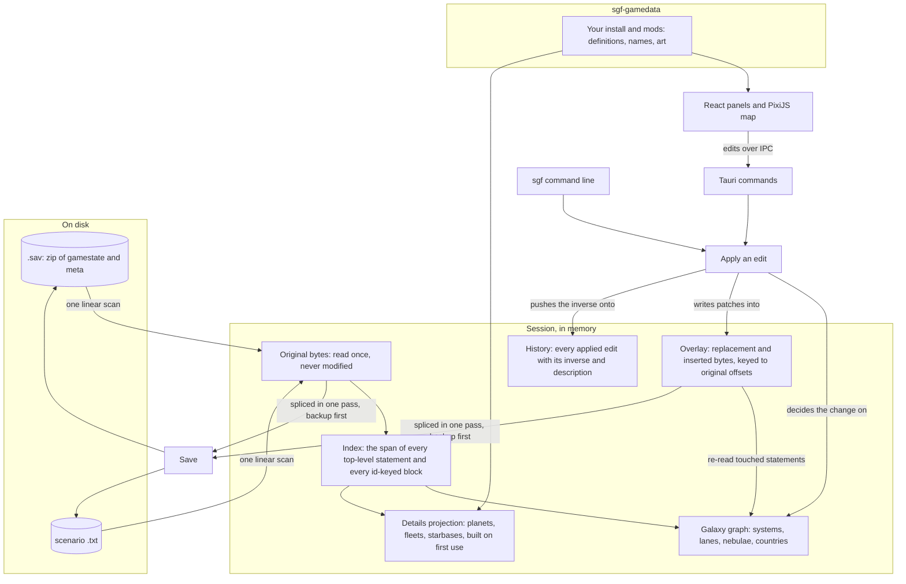

# Architecture

How Stellaris Galaxy Forge holds a document in memory and how an edit
travels from the map to the file. The README has the short version; the
rules every change follows are in [engineering-rules.md](engineering-rules.md).

## Where things live

```
stellaris-galaxy-forge/
├── Cargo.toml                 workspace: crates/* and app/src-tauri
├── VERSION                    the one version; scripts/version.sh copies it into the manifests
├── CHANGELOG.md               Keep a Changelog; every PR adds to Unreleased
├── crates/
│   ├── sgf-core/              the document model; knows nothing about a UI
│   │   ├── src/
│   │   │   ├── archive.rs     the .sav zip: inflate gamestate and meta, backup-then-persist on write
│   │   │   ├── backup.rs      the backups beside a saved file, capped at the original, the three
│   │   │   │                  newest and four spread over the rest
│   │   │   ├── document.rs    a loaded document: original bytes, index, overlay; sniffs save vs scenario
│   │   │   ├── scan.rs        the one-pass index: spans of every statement and id-keyed block
│   │   │   ├── lexer.rs       tokens: bare and quoted scalars, braces, equals
│   │   │   ├── cst.rs         a concrete syntax tree for the statements an edit has to read
│   │   │   ├── span.rs        byte ranges
│   │   │   ├── overlay.rs     patches keyed to original offsets: replace a span or insert at one
│   │   │   ├── emit/          writes the bytes of an edited statement, copying its indentation
│   │   │   ├── format/        the Format trait; save/ and scenario/ are the only per-format code
│   │   │   ├── ops/           every edit: the Op enum in op.rs, its inverse and description; plan.rs
│   │   │   │                  commits an op's edits at once or not at all; rules/ decides what an
│   │   │   │                  edit may do on the graph; history.rs replays bytes for undo
│   │   │   ├── projections/   caches read from the index: the galaxy graph, names, details
│   │   │   ├── session.rs     document + graph + history; apply, undo, redo, save
│   │   │   ├── validate/      what the game could not cope with: the codes, then paint.rs and
│   │   │   │                  scenario.rs for the checks that only apply to one kind of file
│   │   │   ├── search.rs      find systems and entities by name or id
│   │   │   ├── entity/        addressing any entity in the file for the inspector
│   │   │   ├── library.rs     small registers read from the save: colours, bypasses, ship sizes
│   │   │   ├── export/        a save's galaxy written out as a scenario script: the draft and
│   │   │   │                  its report, policy.rs for what carries over, paint/ for the
│   │   │   │                  Paint a Galaxy profile (header, seats, fallen empire zones)
│   │   │   ├── guides.rs      where the game places things at generation: the L-Cluster circle
│   │   │   ├── shape.rs       every key path of a gamestate with its count, and the difference
│   │   │   │                  between two
│   │   │   ├── synth.rs       synthetic saves for stress tests
│   │   │   ├── keys.rs        the statement keys the formats read
│   │   │   └── views.rs       the IPC types; ts-rs exports them to app/src/generated
│   │   └── tests/             outside-in: every op applied to the sample save, insta snapshots,
│   │                          round-trip identity, corpus timing (SGF_CORPUS_DIR)
│   ├── sgf-gamedata/          the user's install and mods, read at runtime
│   │   ├── src/
│   │   │   ├── install/       Steam discovery, mods (the Paint a Galaxy mod by Workshop id), load
│   │   │   │                  order, override semantics
│   │   │   ├── registries/    star and planet classes, colours, deposits, resources, ship sizes,
│   │   │   │                  starbase levels, country types, bypasses, galaxy sizes and shapes,
│   │   │   │                  defines, gfx
│   │   │   ├── loc/           localisation files, language-keyed names
│   │   │   ├── textures/      DDS decoding and the sprite cache
│   │   │   ├── initializers.rs solar_system_initializers: what a system will spawn
│   │   │   ├── scripts/       events, effects, on_actions: who claims what on day one
│   │   │   ├── special.rs     leviathans, enclaves, marauders, fallen empires, landmarks
│   │   │   ├── details.rs     planet, fleet and starbase readers for the inspector
│   │   │   ├── resolver.rs    what details and exports are read through: the install's definitions
│   │   │   │                  when game data is loaded, else the save's own keys
│   │   │   ├── reload.rs      rereading the one registry a changed file under a layer root belongs to
│   │   │   └── views.rs       IPC types
│   │   └── tests/             against a fixture mod in tests/fixtures, and the real install when present
│   └── sgf-cli/               the sgf binary: cli.rs declares it, commands/ one file per verb
├── app/
│   ├── src-tauri/             the Tauri 2 shell (sgf-app)
│   │   ├── src/commands/      the IPC surface: session, scenario, entity, gamedata, listing, update
│   │   ├── src/state.rs       the open session, game data and texture cache behind mutexes
│   │   ├── src/views.rs       the shell's own IPC types, for the updater
│   │   ├── src/watch/         watches the install and mod roots game data was read from
│   │   └── tests/             the commands end to end on the sample save
│   └── src/                   React + TypeScript; a layer imports only from the ones below it
│       ├── test/              builders and stand-ins the tests of every layer share
│       ├── panels/            the React tree: chrome/ (top bar, dock, status bar), inspector/,
│       │                      browser/ (empires, points of interest, issues, changes),
│       │                      file/ (open screen, New scenario), initializers/, search/, overlays/
│       ├── map/               the PixiJS renderer: Camera, MapController, interaction/ (the Select
│       │                      and brush models), layers/ with highlights/ (the brush, drag and
│       │                      symmetry overlays), picking/ (what lies under the pointer)
│       ├── store/             Zustand stores, one per concern: session, editor, galaxy, game data, ...
│       │                      editorStore.*.ts split the editor's actions by subject (nebulae,
│       │                      lanes, brush, ...), editorEdits.ts runs every edit through one queue,
│       │                      symmetricEdits.ts widens an edit under symmetry,
│       │                      fileSessionStore.saveGate.ts asks a save's questions and .writes.ts
│       │                      writes the files, issueNotes.ts raises the app's own notes, fixtures/
│       │                      holds the documents the tests open
│       ├── lib/               pure helpers: geometry/, initializer/, details/, visual/, brush/, keys.ts
│       ├── api/               one function per Tauri command
│       └── generated/         ts-rs output; rewritten by cargo test --workspace, never edited
├── docs/                      this file, the user guide, the engineering rules, the format
│                              and game-data facts, the Paint a Galaxy integration notes, adr/,
│                              media/
├── scripts/                   version.sh and changelog.sh, used by the workflows, and
│                              game-update.sh for a new game version
├── testdata/                  the 4.4 and 4.5 sample saves (git-lfs), the 4.4 save's scenario and
│                              Paint exports, a scenario as Paint a Galaxy writes one, the Issues
│                              fixtures and a grammar fixture
└── .github/                   ci.yml (checks on three OSes), ci-docs.yml (reports those checks as
                               passed for a docs-only change), release.yml (tag, build, publish),
                               changelog.yml, actions/setup, the PR template with the in-game checks
```

## The pieces

- **Rust core, `sgf-core`.** Opens a save or a scenario, indexes it, projects
  the galaxy from it, applies edits and writes the file back. It has no
  idea a UI exists.
- **Game data, `sgf-gamedata`.** Reads the user's Stellaris install and
  active mods at runtime: system initializers, star and planet classes,
  localisation, textures, the scripts that place things at game start. A
  file watcher rebuilds the affected registry when a mod file changes.
- **Command line, `sgf`.** The same edits from a terminal, and the test
  harness for the core.
- **Desktop app.** A Tauri 2 shell (`sgf-app`) around a React and
  TypeScript UI with a PixiJS map. The UI never touches bytes: it sends
  edits to the core over IPC and redraws from what comes back.

## What a session holds



**Original bytes.** A save is a zip with two members, `gamestate` and
`meta`; a scenario is a plain text file. Whichever it is, the text is
inflated or read once and held unchanged for the life of the session.

**Index.** One linear pass over the text records the byte span of every
top-level statement and, inside the sections that hold entities, the span
of every id-keyed block. Structure comes from counting braces; the game
writes keys at column 0 at any depth, so indentation means nothing. The
index is the only structure the editor keeps about the file as a whole:
there is no typed model of it and nothing is ever serialised from one.

**Projections.** The galaxy graph is read from the index: systems with
their positions and lanes, nebulae with their members, countries with the
systems they own. The details projection (planets, deposits, fleets,
starbases, archaeological sites) is built the first time something asks
for it. Both are caches: an edit updates or invalidates them, and they are
never written back.

**Overlay.** Every edit writes its replacement bytes into the overlay,
keyed to the offset of the statement it replaces in the original, or, for
a new statement, to the offset it is inserted at plus a sequence number.
One slot per statement; a later edit to the same statement replaces the
slot. The original bytes are never modified.

**History.** Applying an edit records the edit, a description for the
change log, its inverse, and the slot contents it displaced. Undo puts
the displaced bytes back and redo puts the edit's bytes back; the inverse
describes the change. A `Batch` applies several edits as one entry, and
a refused member leaves the document as it was.

## An edit, end to end

1. The UI or the CLI sends an edit: move system 419 to (x, y).
2. The core decides what changes on the galaxy graph: the system's
   position, and the stored length of each of its lanes on both ends.
3. The format writes the bytes for each touched statement and puts them in
   the overlay. Emitted text copies the indentation of the statement it
   replaces.
4. The graph re-reads the touched statements so the map and the inspector
   show the new state.
5. The inverse (move it back, restore the lengths) goes onto the history.
6. The validator runs over the graph and reports what the game could not
   cope with.

On save, the core streams the original bytes from start to end, emitting
each overlay slot in place of the original span it replaces (or at its
insertion offset), into a new file beside the old one; the old file is
renamed to `<name>.sav.bak-<stamp>` and the new one moved into place.

## Ownership

Who owns a system comes from three places. The structure the text itself
carries lives in `sgf-core`: a save's countries and the systems they
hold, and a scenario's marauder roles and fallen empire zones, read
from the initializers and flags it names. What that text means at game
start lives in `sgf-gamedata`: the scripted owners and day-one claims
its initializer chains and events hand out. The app's
`lib/ownership.ts` merges the two in `composeOwnership` into one owner
table, where a scenario's marauder clan (a home and the raid bases
hyperlaned to it) is one synthetic owner and the scripted marauder
country behind it is dropped, and one map layer paints every owner in
that table.

## Scenario profiles

A scenario is written for a profile: `Plain` is the game's own static
galaxy script, `PaintAGalaxy` is the same script decorated for Oatmeal
Problem's mod. The export builds a plain draft, and `export/paint`
decorates it: the mod's header, a spawn script on every seat, the fallen
empire zones and the wormhole flags. Reading needs no profile: the
scenario format recognises the mod's statements from the bytes
(`format/scenario/paint.rs`, `fe_zone.rs`), so a file the mod's own site
wrote is edited faithfully. In the app, whether a document is a Paint one
is derived in one place, `lib/paint.ts`, from the file's content, the
choice made when it was created and where it lives; the standing choice
and the mod's install state are in `store/paintModStore.ts`, and the
mod itself is found by `sgf-gamedata` (`install/mods.rs`).

## The format seam

A save and a scenario share the byte model, the index, the graph, the
edits and the history. The differences are behind one trait, `Format`:
which statements hold systems, lanes and nebulae; which edits the format
supports (a scenario can add and remove any system and set what it
spawns, and a save carries lane lengths, a scenario does not); and how
each edit's bytes are written. A save can add systems and remove the
ones added this session. Edits decide on the graph; the format
writes the bytes.

## Layers of the app

`app/src` is split by layer. From the bottom up the layers are
`generated/` (the IPC types ts-rs writes from the Rust crates), `api/` (one
function per Tauri command), `lib/` (pure helpers over the generated
types), `store/` (session state and the actions the UI calls), `map/` (the
PixiJS renderer) and `panels/` (the React tree around the map). A layer
imports only from the ones before it.
`app/src/lib/README.md` and `app/src/panels/README.md` state the rule and
its exceptions.
