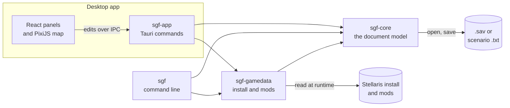
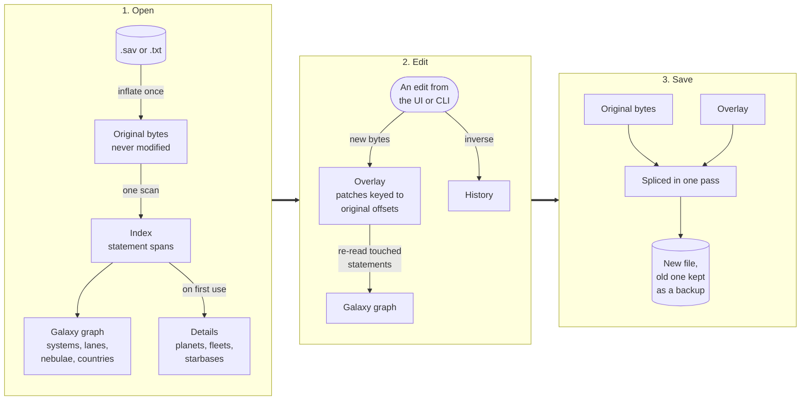
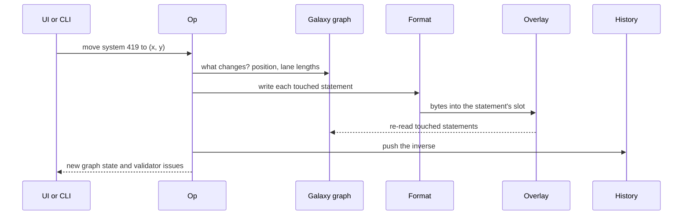

# Architecture

This page explains how Stellaris Galaxy Forge holds a document in memory
and how an edit gets from the map to the file. The README has the short
version. The rules every change follows are in
[engineering-rules.md](engineering-rules.md).

## The pieces


```mermaid
flowchart LR
  subgraph app["Desktop app"]
    UI["React panels<br/>and PixiJS map"]
    Shell["sgf-app<br/>Tauri commands"]
  end
  CLI["sgf<br/>command line"]
  Core["sgf-core<br/>the document model"]
  GD["sgf-gamedata<br/>install and mods"]
  File[(".sav or<br/>scenario .txt")]
  Install[("Stellaris install<br/>and mods")]

  UI -->|"edits over IPC"| Shell
  Shell --> Core
  Shell --> GD
  CLI --> Core
  CLI --> GD
  GD --> Core
  Core -->|"open, save"| File
  GD -->|"read at runtime"| Install
```

- `sgf-core` is the Rust core. It opens a save or a scenario, indexes
  it, projects the galaxy from it, applies edits and writes the file
  back. It has no idea a UI exists.
- `sgf-gamedata` reads the user's Stellaris install and active mods at
  runtime. That covers system initializers, star and planet classes,
  localisation, textures and the scripts that place things at game
  start. When a mod file changes, a file watcher rebuilds the registry
  it affects. It also rolls the systems added to a save from the
  install's own rules.
- `sgf` is the command line. `sgf apply` runs the same edits from a
  terminal, as ops written in JSON files. It is also the test harness
  for the core.
- The desktop app is a Tauri 2 shell (`sgf-app`) around a React and
  TypeScript UI with a PixiJS map. The UI never touches bytes. It sends
  edits to the core over IPC and redraws from what comes back.

## Where things live

```
crates/
  sgf-core/        the document model
  sgf-gamedata/    the user's install and mods
  sgf-cli/         the sgf binary
app/
  src-tauri/       the Tauri shell
  src/             the React + TypeScript UI
docs/  scripts/  testdata/  workshop/  .github/  changelog.d/
```

The tables below go one level deeper. Each path is relative to the
folder in the table's heading.

### `crates/sgf-core/src`

The document model. It knows nothing about a UI.

| Path | What's in it |
| --- | --- |
| **Reading the file** | |
| `archive.rs` | The `.sav` zip: inflates `gamestate` and `meta`, and writes backup-then-persist |
| `document.rs` | A loaded document (original bytes, index, overlay), and whether it is a save or a scenario |
| `scan.rs` | The index, built in one pass: the span of every statement and id-keyed block |
| `lexer.rs` | Tokens: bare and quoted scalars, braces, equals |
| `cst.rs` | A concrete syntax tree for the statements an edit has to read |
| `span.rs` | Byte ranges |
| `keys.rs` | The statement keys the formats read |
| **Editing** | |
| `session/` | Holds the document, graph and history. `file.rs` opens and saves, `edit.rs` applies, undoes and redoes, and the rest answer the reads the shell and CLI ask for |
| `ops/` | Every edit. `op.rs` has the `Op` enum, and `Op::reach` gives each op the document kinds that take it and how its details go stale. The planners under `format/*/write` build each op's edits, description and inverse. `edit.rs` is what they plan in, `plan.rs` commits all of an op's edits or none of them, and `error.rs` holds the refusals. `rules/` decides what an edit may do to the graph. `history.rs` puts bytes back for undo |
| `overlay.rs` | Patches keyed to original offsets: replace a span or insert at one |
| `emit/` | Writes the bytes of an edited statement, copying its indentation |
| `format/` | The `Format` trait. `save/` and `scenario/` are the only per-format code. `save/details/` projects a system's planets, fleets and starbase. `save/write/` writes the save ops, and `game_tables.rs` holds what is copied from the game's files |
| **Reading the galaxy back** | |
| `projections/` | Caches read from the index: the galaxy graph and names, the readers they share, and `geometry.rs`, where a system's bodies stand about their parents |
| `entity/` | Finds any entity in the file for the inspector |
| `search.rs` | Finds systems and entities by name or id, and systems by what they hold |
| `validate/` | Checks for what the game could not cope with. `paint.rs` and `scenario.rs` hold the checks that apply to only one kind of file |
| `guides.rs` | Where the game places things at generation (the L-Cluster circle) |
| **Other files** | |
| `export/` | Writes a save's galaxy out as a scenario, as a draft with a report. `policy.rs` decides what is kept. `paint/` adds the Paint a Galaxy header, seats and fallen empire zones |
| `backup.rs` | The backups beside a saved file: the original, the three newest and four spread over the rest |
| `library.rs` | Where this machine keeps its saves, and what each campaign folder holds, for the Open screen |
| **Tooling** | |
| `views.rs` | The IPC types. ts-rs exports them to `app/src/generated` |
| `shape.rs` | Every key path of a gamestate with its count, and the difference between two |
| `synth.rs` | Synthetic saves for stress tests |
| `../tests/` | Each op applied to the sample saves and snapshotted with insta, the round trip, corpus timing, and `constants.rs`, which writes `app/src/generated/constants.ts` |

### `crates/sgf-gamedata/src`

The user's install and mods, read at runtime.

| Path | What's in it |
| --- | --- |
| **Finding the files** | |
| `install/` | Finds Steam, the install and the mods (Paint a Galaxy by its Workshop id), and works out load order and overrides |
| `reload.rs` | Rereads only the registry a changed file belongs to |
| **Definitions** | |
| `registries/` | Star and planet classes, colours, deposits, resources, ship sizes, starbase levels, country types, bypasses, galaxy sizes and shapes, defines, gfx. `terraform_links.rs` says which modifier makes a planet a terraforming candidate |
| `loc/` | Localisation files and language-keyed names |
| `textures/` | DDS decoding, the sprite cache, and the planet and star discs the system view draws (`sphere.rs`) |
| `fonts.rs` | The typeface the map writes empire names in |
| `initializers.rs` | `solar_system_initializers`: what a system will spawn |
| `scripts/` | Events, effects and on_actions: who claims what on day one |
| `special.rs` | Leviathans, enclaves, marauders, fallen empires, landmarks |
| `condition.rs` | A trigger block compiled to the conditions the crate can judge |
| `weight.rs` | A weight block: a base, its factors and its modifiers |
| **Rolling a system for Add system** | |
| `generate/` | Rolls a system from the install's rules, with `rng.rs` for its random numbers. `save.rs` builds the bodies and systems added to a save, and the class rules a class change takes |
| `picks.rs` | The classes the Add system and Add body menus offer |
| `orbit_walk.rs` | Places each planet and moon of an initializer as the engine does. The roller, the example roll and the scenario details all use it |
| `layouts.rs` | The `misc_system_init` layouts the generator can build |
| `deposit_roll.rs` | The deposits a generated body rolls |
| `body_effects.rs` | What a layout's `init_effect` does to a body it places |
| `naming.rs` | Names for the systems and nebulae the editor places |
| `menu.rs` | The Special menu of Add system |
| `summary.rs` | The hover card of an Add system pick |
| **What the panels show** | |
| `details.rs` | A scenario system's details from its initializer, the example roll the system view shows, and each save body's star class and whether it is a moon |
| `planet_views.rs` | What the planet page shows from the install |
| `choices.rs`, `*_choices.rs`, `planet_models.rs` | The planet the page's pickers ask about, and what each offers to add: anomalies, deposits, dig sites, modifiers and models |
| `resolver.rs` | Gives details and exports the install's definitions when game data is loaded. Without game data they use the save's own keys |
| `views/` | The IPC types, one file per family of registries |
| `../tests/` | Tests against a fixture mod in `tests/fixtures`, and against the real install when there is one |

### `crates/sgf-cli`

The `sgf` binary. `cli.rs` declares it, and `commands/` has one file per
verb. `apply.rs` runs the edits that JSON files hold.

### `app/src-tauri`

The Tauri 2 shell, `sgf-app`.

| Path | What's in it |
| --- | --- |
| `src/commands/` | The IPC surface: session, scenario, entity, gamedata, listing, add_system, add_body, nebula, paint, update |
| `src/state.rs` | The open session, game data and texture cache behind mutexes |
| `src/views.rs` | The shell's own IPC types, for the updater and Add planet |
| `src/watch/` | Watches the install and mod roots game data was read from |
| `tests/` | The commands end to end on the sample save. `constants.rs` writes `app/src/generated/shell.ts`: the event names and the releases URL |

### `app/src`

React and TypeScript. The folders are layers, listed from the top. A
layer imports only from the layers below it. `lib/README.md` and
`panels/README.md` state the rule and its exceptions.

| Path | What's in it |
| --- | --- |
| `panels/` | The React tree: `chrome/` (top bar, dock, status bar), `inspector/`, `browser/` (empires, points of interest, issues, changes), `file/` (Open screen, New scenario), `initializers/`, `search/`, `overlays/` |
| `map/` | The PixiJS renderer. `MapController` runs the ticker and handles resize, the wheel and the pan keys for whichever scene is showing. `GalaxyScene` has the galaxy's camera, layers and bindings. `tilt.ts` and `drawnPositions.ts` say where the lean of the galaxy plane and the heights put each system, and every galaxy layer draws through them |
| `map/interaction/` | The Select and brush models, and `pointerBridge.ts`, which feeds both scenes their input |
| `map/layers/` | The galaxy map's layers, one file each. `highlights/` has the brush, drag and symmetry overlays |
| `map/picking/` | What lies under the pointer |
| `map/system/` | The system view. `sources.ts` reads one `SceneSubject` (the system's details, roll, node and neighbours) for either kind of document, and `context.ts` turns it into what the layers draw. `picking.ts` names what lies under the pointer as one `SceneTarget`. `bodyDrag.ts` and `drags.ts` hold the drags. `camera.ts` fits the view to the system. `layers/` has bodies, orbits, belts, labels, radii, exits, handles, locks, wormholes, nebula, the highlight and the rolled placeholders |
| `store/` | Zustand stores, one per concern: session, editor, galaxy, game data and so on |
| `store/editorStore.*.ts` | The editor's actions, split by subject (nebulae, lanes, brush, ...) |
| `store/editorEdits.ts` | The queue every edit runs through. `symmetricEdits.ts` widens an edit under symmetry |
| `store/fileSessionStore.*.ts` | `saveGate.ts` asks the questions before a save. `writes.ts` writes the files |
| `store/planetEditAdapter.ts` | The ops a save body's page sends. `systemGeometry.ts` applies a system's geometry edits, and `resetScopes.ts` says which stores a closed document or reloaded game data resets |
| `lib/` | Pure helpers over the generated types: `geometry/`, `initializer/`, `details/`, `visual/`, `brush/`, `keys.ts`. `lib/README.md` says what each holds |
| `api/` | One function per Tauri command, one file per module of `src-tauri/src/commands`, all re-exported by `ipc.ts` |
| `generated/` | ts-rs output, `constants.ts` and `shell.ts`. `cargo test --workspace` rewrites it, so don't edit it by hand |
| `test/` | Builders and stand-ins the tests of every layer share, and `ipc.ts`, the one set of command spies. `setup.ts` mocks the dialog plugin once for every test file, and `README.md` says how to open a document in a test. `store/storeFixture.ts` resets every store for a test |

### The rest of the repository

| Path | What's in it |
| --- | --- |
| `Cargo.toml` | The workspace: `crates/*` and `app/src-tauri` |
| `VERSION` | The version number. `scripts/version.sh` copies it into the manifests |
| `CHANGELOG.md`, `changelog.d/` | Keep a Changelog. Each PR adds a file to `changelog.d/`, and the release folds them into `CHANGELOG.md` |
| `docs/` | This file, the user guide, the engineering rules, the format and game-data facts, the Paint a Galaxy notes, `adr/`, `media/` |
| `scripts/` | `version.sh`, `changelog.sh` and `docs-only.sh` for the workflows, and `game-update.sh` for a new game version |
| `testdata/` | The 3.4, 4.4 and 4.5 sample saves (git-lfs), the 4.4 save's scenario and Paint exports, a scenario as Paint a Galaxy writes one, the Issues fixtures, a grammar fixture and two add-system specs |
| `workshop/` | The Steam Workshop page, and the uploader that pushes it to Steam (its own Cargo package) |
| `.github/` | `ci.yml` runs the checks on three OSes. `ci-docs.yml` reports them as passed for a docs-only change. `release.yml` tags, builds and publishes. Also `changelog.yml`, `actions/setup`, and the PR template with the in-game checks |

## What a session holds


```mermaid
flowchart LR
  subgraph open["1. Open"]
    direction TB
    F1[(".sav or .txt")] -->|"inflate once"| B1["Original bytes<br/>never modified"]
    B1 -->|"one scan"| I1["Index<br/>statement spans"]
    I1 --> G1["Galaxy graph<br/>systems, lanes,<br/>nebulae, countries"]
    I1 -->|"on first use"| D1["Details<br/>planets, fleets,<br/>starbases"]
  end
  subgraph edit["2. Edit"]
    direction TB
    E2(["An edit from<br/>the UI or CLI"]) -->|"new bytes"| O2["Overlay<br/>patches keyed to<br/>original offsets"]
    E2 -->|"inverse"| H2["History"]
    O2 -->|"re-read touched<br/>statements"| G2["Galaxy graph"]
  end
  subgraph save["3. Save"]
    direction TB
    B3["Original bytes"] --> S3["Spliced in one pass"]
    O3["Overlay"] --> S3
    S3 --> F3[("New file,<br/>old one kept<br/>as a backup")]
  end
  open ==> edit ==> save
```

A save is a zip with two members, `gamestate` and `meta`. A scenario is
a plain text file. The session inflates or reads the text once and keeps
those original bytes unchanged for as long as it is open.

The index comes from one linear pass over the text. It records the byte
span of every top-level statement. Inside the sections that hold
entities, it also records the span of every id-keyed block. Structure
comes from counting braces. The game writes keys at column 0 at any
depth, so indentation means nothing. The index is the only structure
the editor keeps about the file as a whole, apart from what the
document caches beside it. A save keeps its `nebula` sections and the
systems, planets, deposits, dig sites and wormholes an op added, both read
back from the overlay after every edit. It also keeps the countries that
have found each planet's anomaly and what clearing each blocker costs,
read on first use. The index of an inner section (`planets.planet`,
`starbase_mgr.starbases`, `archaeological_sites`) is built the first time
an address needs it. A scenario keeps its own index of the statements it
reads. The `meta` bytes of a save are held beside the original, with the
version an op rewrote. There is no typed model of the file, and nothing is
ever serialised from one.

The galaxy graph is a projection read from the index. It holds systems
with their positions and lanes, nebulae with their members, and
countries with the systems they own. The details projection covers
planets, deposits, fleets, starbases and archaeological sites. It is
built the first time something asks for it. Both projections are
caches. An edit updates or invalidates them, and they are never written
back.

Every edit writes its replacement bytes into the overlay. A replacement
is keyed to the offset, in the original, of the statement it replaces.
A new statement is keyed to the offset it is inserted at, plus a
sequence number. Each statement has one slot, and a later edit to the
same statement replaces what is in it. The original bytes are never
modified.

When an edit is applied, the history records the edit, a description
for the change log, its inverse, and the slot contents the edit
replaced. Undo puts those old bytes back, and redo puts the edit's bytes
back. A `Batch` applies several edits
as one history entry. If any of them is refused, the document is left as
it was.

An op is a variant of `Op`. Its row from `Op::reach` says which document
kinds take it, whether it leaves the details projection stale and how that
is brought up to date (read again in place, or built again), whether it
reclassifies systems, whether it needs a 4.x save, and whether it takes a
second step once the first is committed. The format's planner for the op
decides its edits, its description and its inverse, in terms of the
primitive in `ops/edit.rs`. `ops/plan.rs` commits the edits together, and
`ops/error.rs` holds the reasons an op is refused. The session refuses
from outside an op that is only ever an inverse.

## An edit, end to end


```mermaid
sequenceDiagram
  participant UI as UI or CLI
  participant Op as Op
  participant Graph as Galaxy graph
  participant Fmt as Format
  participant Ov as Overlay
  participant Hist as History
  UI->>Op: move system 419 to (x, y)
  Op->>Graph: what changes? position, lane lengths
  Op->>Fmt: write each touched statement
  Fmt->>Ov: bytes into the statement's slot
  Ov-->>Graph: re-read touched statements
  Op->>Hist: push the inverse
  Op-->>UI: new graph state and validator issues
```

1. The UI or the CLI sends an edit: move system 419 to (x, y).
2. The core decides what changes on the galaxy graph. Here that is the
   system's position, and the stored length of each of its lanes on
   both ends.
3. The format writes the bytes for each touched statement and puts them
   in the overlay. Emitted text copies the indentation of the statement
   it replaces.
4. The graph re-reads the touched statements, so the map and the
   inspector show the new state.
5. The inverse (move it back, restore the lengths) goes onto the
   history.
6. The validator runs over the graph and reports what the game could not
   cope with.

On save, the core streams the original bytes from start to end into a
new file beside the old one. Where an overlay slot replaces a span, the
slot's bytes go out instead of the original ones. An inserted statement
goes out at its insertion offset. The old file is then renamed to
`<name>.sav.bak-<stamp>` and the new one is moved into place.

## Ownership

Who owns a system comes from three places. `sgf-core` reads the
structure written in the text. In a save, that is the countries and
the systems they hold. In a scenario, it is the marauder roles and
fallen empire zones, read from the initializers and flags the scenario
names. `sgf-gamedata` works out what that text means at game start: the
scripted owners and day-one claims that its initializer chains and
events hand out.

In the app, `composeOwnership` in `lib/ownership.ts` merges the two into
a single owner table. A scenario's marauder clan (a home and the raid
bases hyperlaned to it) becomes one synthetic owner in that table, and
the scripted marauder country behind it is dropped. A single map layer
paints every owner in the table.

## Scenario profiles

A scenario is written for a profile. `Plain` is the game's own static
galaxy script. `PaintAGalaxy` is the same script decorated for Oatmeal
Problem's mod. The export builds a plain draft, and `export/paint`
decorates it with the mod's header, a spawn script on every seat, the
fallen empire zones and the wormhole flags.

Reading a scenario needs no profile. The scenario format picks out the
mod's statements from the bytes (`format/scenario/paint.rs`,
`fe_zone.rs`), so the editor keeps them in a scenario another tool
wrote for the mod.

In the app, `lib/paint.ts` decides whether a document is a Paint one. It
goes by the file's content, the choice made when the file was created,
and where the file is. `store/paintModStore.ts` holds the standing
choice and the mod's install state. `sgf-gamedata` finds the mod itself
(`install/mods.rs`).

## The format seam

A save and a scenario share the byte model, the index, the graph, the
edits and the history. What differs between them is behind the `Format`
trait. It says which statements hold systems, lanes and nebulae, which
edits the format supports, and how each edit's bytes are written. Each
op's row in `Op::reach` says which kinds take it. A scenario can add and
remove any system and set what it spawns. A save can add systems and
remove the ones added this session. It can also edit its bodies: star
classes, planet sizes, classes and models, orbits and belts, moons, deposits,
modifiers, anomalies and dig sites. It can delete planets and moons,
remove colonies, move a planet to another system, move wormholes, add and
remove wormhole pairs, set system heights, and change an empire's name,
flag and map colours. A save stores lane lengths, and a scenario does not.
An edit decides what changes on the graph, and the format writes the bytes.

The planet page is one `BodyPage` for every kind of document. A
`BodySource` for each kind reads the body and the rows its page lists, and
gives the page the adapter that edits it. A system's geometry is edited
through one adapter per kind too, and `lib/documentKinds.ts` holds the other
things that differ between kinds as one row each. The scene reads a system
through one `SceneSubject`, and the system view's drags go through one
`SceneTarget`. `app/src/lib/README.md` and `app/src/panels/README.md` say
which module holds what.
