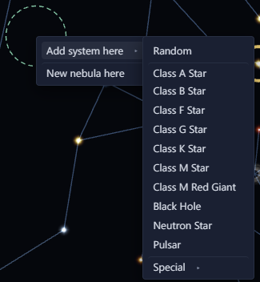
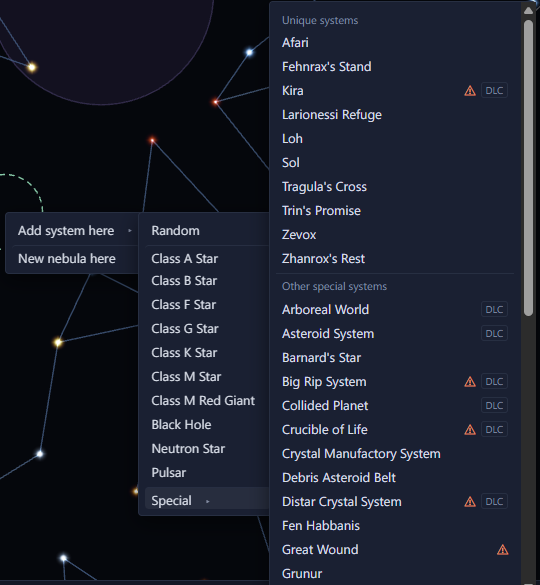
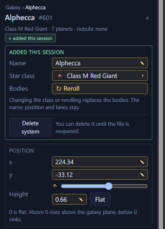

# Add and delete systems <Badge type="tip" text="Save" /> <Badge type="info" text="Scenario" />

Right-click empty space to add a system. A save and a scenario offer
different choices.

## Add a system to a save <Badge type="tip" text="Save" />

Right-click empty space and pick "Add system here", then Random or a
star class. The last entry, Special, lists the game's special systems in
two groups: unique systems such as Zevox and Sol, and other special
systems such as Trappist. Hover an entry to see its star, planets, belts
and notable bodies. A warning mark means the galaxy already has that
system and the game normally places only one. You can still add another.
A lock means the save doesn't have the DLC the system belongs to, so its
events won't run. The game's scripted extras for special systems, such
as anomalies and background clouds, are not added. Sol comes without an
empire, so Earth is an uncolonised continental world. Other named
systems, such as New Bratulla and Vultaumar, come without their empires,
pre-FTL civilisations, guardians and fleets.

A system added inside a nebula joins it.

## Reroll an added system <Badge type="tip" text="Save" />

Reroll on the new system's page builds the same special system again.
Picking a star class there generates a regular system around that star.

<Annotated :marks="[
  { n: 1, box: [8, 119, 330, 24], label: 'Name' },
  { n: 2, box: [8, 145, 330, 24], label: 'Star class' },
  { n: 3, box: [8, 171, 330, 24], label: 'Reroll the bodies' },
  { n: 4, box: [8, 242, 95, 42], label: 'Delete system' },
  { n: 5, box: [8, 304, 330, 160], label: 'Position and height' }
]">

</Annotated>

## Rename a system

In a save, you can rename a system you added this session. Type a new
name in the Name field on its page. Its star and planets take the new
name.

In a scenario, you can rename any system. Type into the name at the top
of its page. A system with no name shows "Random name", and Stellaris
picks one when the game starts.

## Add a system to a scenario <Badge type="info" text="Scenario" />

Right-click empty space to add a system. "New system from…" adds one
that spawns from the [initializer](../scenario/initializers.md) you pick.
To add many at once, use the [Paint systems brush](brushes.md#paint-and-erase-systems).

## Delete systems

In a save, only the systems you added since opening it can be deleted.
To take out a system you added this session, select it and press
<kbd>Delete</kbd>, or right-click it and pick "Delete system". To delete
several, select them, right-click one and pick "Delete N added systems".
Systems the save already had can't be deleted.

In a scenario, select systems and press <kbd>Delete</kbd> to remove
them.
