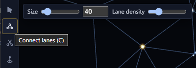
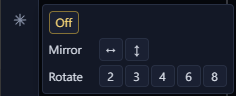
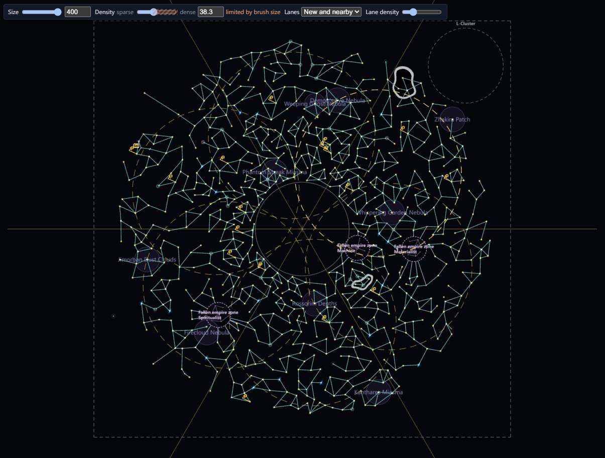

# Brushes and symmetry <Badge type="tip" text="Save" /> <Badge type="info" text="Scenario" />

The brushes on the tool strip work in broad strokes. Each stroke is one
undo step. While a brush is active, its options show beside the tool
strip. Every brush has a Size option, and <kbd>[</kbd> and <kbd>]</kbd>
resize it too.

## Connect and cut lanes with a brush

The Connect lanes (<kbd>C</kbd>) and Cut lanes (<kbd>X</kbd>) brushes
add and cut hyperlanes under the brush. Holding <kbd>Alt</kbd> swaps the
two. The Connect brush has a Lane density option, from sparse to dense
lanes.

## Paint and erase systems <Badge type="info" text="Scenario" />

Paint systems (<kbd>B</kbd>) scatters new systems under the brush and
joins them with lanes. Erase systems (<kbd>E</kbd>) removes them.
Holding <kbd>Alt</kbd> swaps the two.

Paint has these options:

- Density goes from sparse to dense. The number beside it is the
  distance between painted systems.
- Lanes picks which lanes a stroke adds: Off, Among new, or New and
  nearby, which also links the new systems to the ones around them.
- Lane density goes from sparse to dense lanes.

Erase has these options:

- Target sets what the brush removes. Systems removes the systems and
  their lanes. Lanes only removes the lanes and leaves the systems.
- Tick Also erase special systems to let the brush remove systems with
  an initializer, a spawn point or another special role. Leave it
  unticked to keep them.

The Height brush (<kbd>H</kbd>) is on the
[System heights](heights.md#shape-heights-with-the-height-brush) page.

## Use symmetry <Badge type="info" text="Scenario" />

In a scenario, symmetry mirrors your edits around the centre of the
galaxy or repeats them around it. Click the Symmetry button under the
tools and pick "Mirror left–right", "Mirror top–bottom", or a 2-, 3-,
4-, 6- or 8-fold rotation. <kbd>Shift</kbd>+<kbd>M</kbd> turns symmetry
off, and on again with the last choice. Saves have no symmetry.

