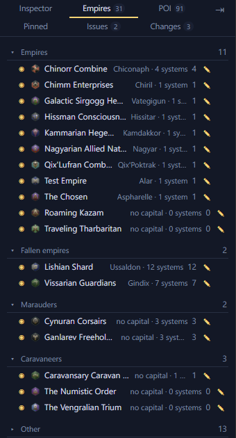
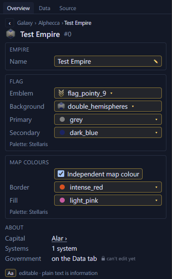
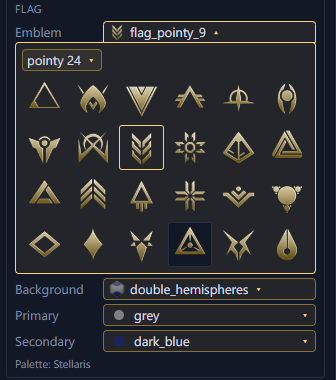

# Empires and the L-Gate <Badge type="tip" text="Save" />

Open an empire's page from the Empires tab, or click the owner's name at
the top of one of its systems.

## Rename an empire

An empire's page has a Name field at the top. Type a new name to
rename the empire. Renaming your own empire also renames the save on
the load game screen.

## Change an empire's flag

An empire's page sets its flag: the emblem, the background, and the
primary and secondary colours. For the player's empire, the load game
screen shows the new flag too.

## Change an empire's map colours

In a Stellaris 4.5 save, the page also has "Independent map colour".
With it on, pick the border and fill colours. With it off, the map uses
the flag's primary and secondary colours.

## See a pre-FTL civilisation's age

A pre-FTL civilisation's page shows its age, such as Stone Age.

## Change the L-Gate outcome

With nothing selected, the Inspector can reveal which L-Gate outcome
the save rolled. You can change it until a gate opens.
