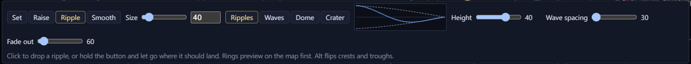
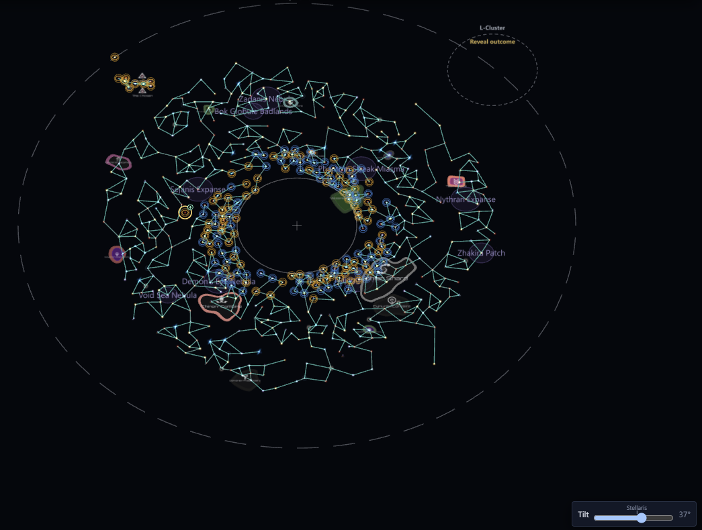

# System heights <Badge type="tip" text="Save" />

In a save, each system can sit above or below the galaxy plane. The
game shows a raised star with a line down to the plane, and its
hyperlanes follow it. Stars start flat, at 0.

## Set a system's height

A system's Overview tab has a Height slider under Position. The map
follows the slider as you drag, and the edit lands when you let go.
Flat puts it back at 0.

## Change several systems at once

With several systems selected, the Inspector shows a strip of their
heights. Set to, Raise by and Lower by change them all, and Flatten
puts them back at 0.

## Shape heights with the Height brush

The Height brush (<kbd>H</kbd>) on the tool strip has four modes. Set
gives everything under the brush one height. Raise lifts the middle most
and the edge least, and <kbd>Alt</kbd> lowers instead. Smooth evens out
the systems under it. Ripple drops rings of crests and troughs where you
let go. The Ripples, Waves, Dome and Crater presets are a starting
point, and the graph shows the shape before you click.

## See the heights

The Heights layer is on by default. A raised star has an amber ring and
a sunk one a blue ring. Flat stars look as before.

The Tilt slider at the bottom right tilts the map so you can see the
heights. The Stellaris mark is the game's own camera angle.
Double-click the slider to lay the map flat. Everything works while
tilted, including moving systems and editing lanes.

## Good to know

Scenarios have no heights. The game ignores a height in a scenario, so
these tools are hidden there.
