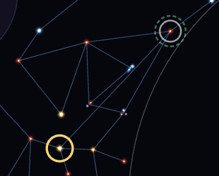
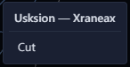
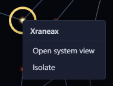

# Hyperlanes <Badge type="tip" text="Save" /> <Badge type="info" text="Scenario" />

Hyperlanes join systems. You can draw them one at a time, in broad
strokes with a [brush](brushes.md), or between every system you select.

## Draw a hyperlane

Zoom in until a ring appears around a star, then drag from the ring to
another system. <kbd>Shift</kbd>+drag from the star works at any zoom.

## Cut a hyperlane

Hover a lane and click the "×" at its middle. Right-click a system and
pick "Isolate" to remove all its lanes.

Right-clicking a lane also offers Cut.

## Connect or cut several systems at once

With several systems selected, the Inspector offers "Connect to each
other", "Connect as mesh" and "Cut hyperlanes between".

## Join a split galaxy

When the galaxy is in separate pieces, a "Join" button appears beside
Components in the Inspector. It reconnects the pieces with the shortest
hyperlanes that don't cross any others.

## Reset a lane's length <Badge type="tip" text="Save" />

The game uses a hyperlane's stored length as its travel cost. A lane
whose length doesn't match its distance is marked "!". "Reset length"
fixes it.

## Prevent a lane <Badge type="info" text="Scenario" />

Right-click a hyperlane and pick "Cut and prevent" so the game never
generates it. Right-click a prevented lane and pick "Allow" to undo
that.
