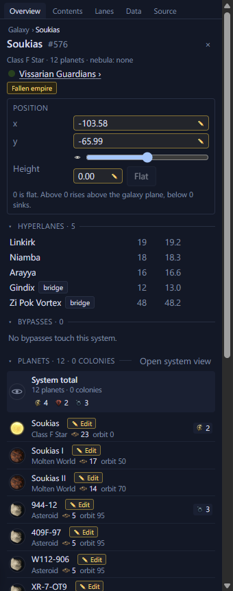

# Select and move systems <Badge type="tip" text="Save" /> <Badge type="info" text="Scenario" />

Most edits start with a selection. A moved system takes its lanes,
planets and fleets along.

## Select systems

Click a system to select it. <kbd>Ctrl</kbd>+click adds or removes one,
and dragging on empty space draws a selection box. <kbd>Esc</kbd> clears
the selection.

## Move a system

Drag a star to move it. If it is part of a selection, the whole
selection moves. <kbd>Shift</kbd>+arrow nudges the selection. For an
exact spot, type into the Position fields on the Inspector's Overview
tab. A moved system keeps its hyperlanes and their lengths are updated.
Its planets and fleets move with it.

To take systems out, see [Delete systems](add-systems.md#delete-systems).
