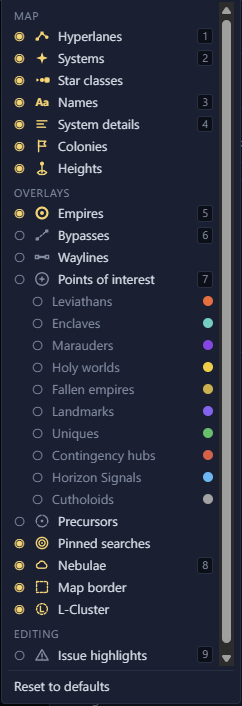

# Layers <Badge type="tip" text="Save" /> <Badge type="info" text="Scenario" />

Layers decide what the map shows. The Layers menu in the top bar holds
every layer, and "Reset to defaults" at its foot puts them back.

## Switch the main layers

The number keys <kbd>1</kbd> to <kbd>9</kbd> switch the main map layers.

| Key | Layer |
| --- | --- |
| <kbd>1</kbd> | Hyperlanes |
| <kbd>2</kbd> | Systems |
| <kbd>3</kbd> | Names |
| <kbd>4</kbd> | System details |
| <kbd>5</kbd> | Empires |
| <kbd>6</kbd> | Bypasses |
| <kbd>7</kbd> | Points of interest |
| <kbd>8</kbd> | Nebulae |
| <kbd>9</kbd> | Issue highlights |

## See where precursors can turn up <Badge type="tip" text="Save" />

Turn on Precursors in the Layers menu to see where each precursor's
anomalies can turn up in a save. Anomalies appear when a science ship
surveys a planet, so the layer shows the systems that can have them,
not the planets that will. Each precursor has its own ring colour.
A system in two precursors' regions shows a split ring, and a system
in none has a thin grey ring. The menu lists every precursor with its
number of systems. Click the eye beside one to hide its rings. The
layer needs game data from your Stellaris install.

## Every layer

The menu lists the layers in three groups. A layer only shows in the
menu when the open file can have it.

### Map

| Layer | Shows |
| --- | --- |
| Hyperlanes | The lanes between systems. |
| Systems | The stars. |
| Star classes | Each star in its class's look. With it off, every star looks the same. |
| Names | System names. |
| System details | The icons, resources, habitable planets and fleets under each system when you zoom in. |
| Orbit radii | The radius of each orbit, in a [system view](../system/system-view.md) only. |
| Colonies | The owner's flag and colour on a colony's name. |
| Heights | A ring on each raised or sunk star, in a save. See [System heights](../edit/heights.md). |

### Overlays

| Layer | Shows |
| --- | --- |
| Empires | Each empire's territory. |
| Day-one claims | The systems scripts give to empires on day one, in a scenario. |
| Day-one bypasses | The bypasses scripts place on day one, in a scenario. |
| Bypasses | Wormhole pairs, gateways, the L-Gate and other bypasses. |
| Waylines | Waystations and the waylines between them, in a save. |
| Points of interest | A ring and a label on special systems, such as leviathans and enclaves. Each kind has its own row under it. |
| Precursors | Where each precursor's anomalies can turn up, in a save. |
| Pinned searches | A ring around the systems each [pinned search](search.md#pin-a-search) finds. |
| Initializer keys | Each system's [initializer](../scenario/initializers.md), in a scenario. |
| Spawn points | The systems empires can start on, in a scenario. |
| Fallen empire zones | The rings where Paint a Galaxy builds fallen empires. |
| Marauder clans | The clans' homes and outposts, in a scenario. |
| Nebulae | The nebulae. |
| Map border | The edge of the galaxy, or the square a scenario is drawn in. |
| L-Cluster | The space kept for the L-Cluster. |

### Editing

| Layer | Shows |
| --- | --- |
| Issue highlights | A ring around each system the [Issues tab](../safety/issues.md) names. |

## Layers in a scenario <Badge type="info" text="Scenario" />

In a scenario the menu groups the layers by where they come from:
Scenario, Initializers and Scripts. Initializers and Scripts each have
an "all" switch. <kbd>0</kbd> flips the Initializers group, and
<kbd>&#96;</kbd> or <kbd>~</kbd> flips the Scripts group. Both groups need
game data from your Stellaris install.
