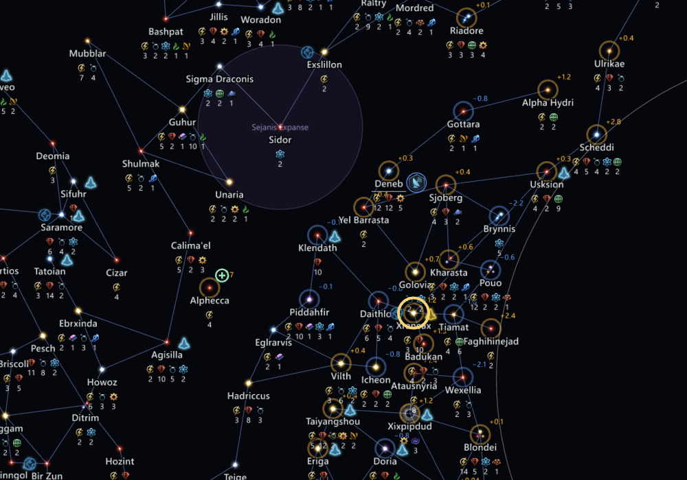

# Move around the map <Badge type="tip" text="Save" /> <Badge type="info" text="Scenario" />

The galaxy map fills the window, with the dock on the right.

## Pan and zoom

Drag with the middle mouse button to pan, or hold <kbd>W</kbd>
<kbd>A</kbd> <kbd>S</kbd> <kbd>D</kbd> or the arrow keys. Hold <kbd>Shift</kbd> as well to pan
faster. Scroll the mouse wheel to zoom. Press <kbd>Home</kbd> to fit the whole galaxy in the
window.

While you drag a system with the left button, you can still pan with the middle mouse button,
so you can move the system past the edge of the window. Hold the middle button and move the mouse
to pan, then let go of it and keep dragging. The system lands where you let go of the left button.

To find one system, use [Search](search.md). To change what the map
shows, use [Layers](layers.md).

## Use the dock

The dock on the right has the Inspector, Empires, Points of interest,
Pinned searches, Issues and Changes tabs. With nothing selected, the
Inspector shows the whole galaxy. <kbd>Tab</kbd> hides or shows the dock.

## Star art and names

When the app finds your Stellaris install, the map uses the game's star
art and names, with your mods. Without it, the map draws plain stars and
generated names.
