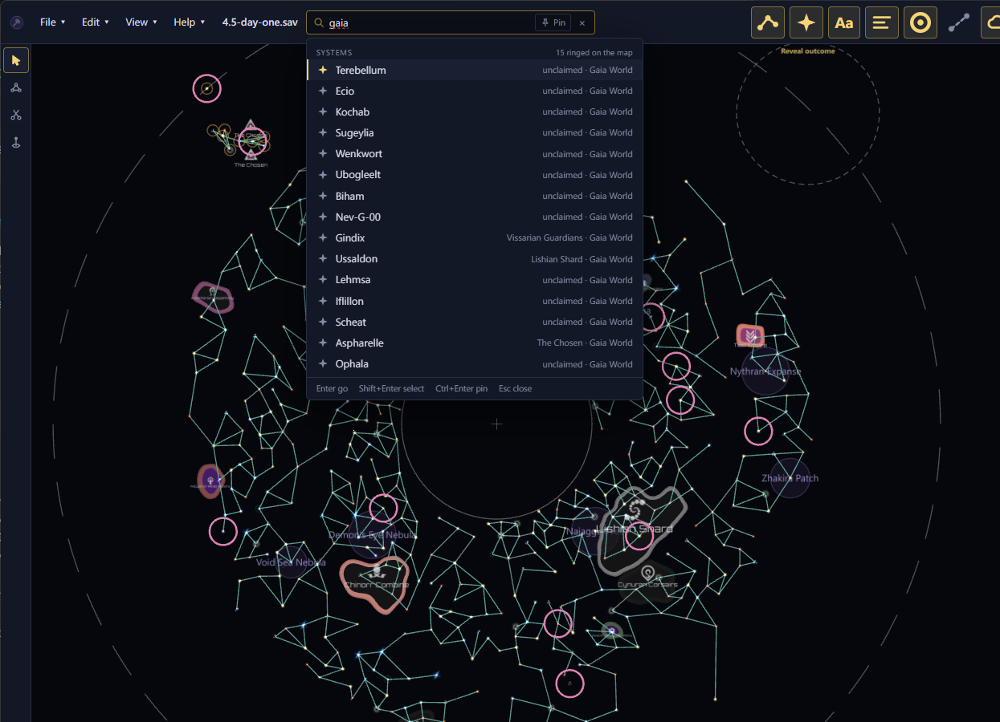
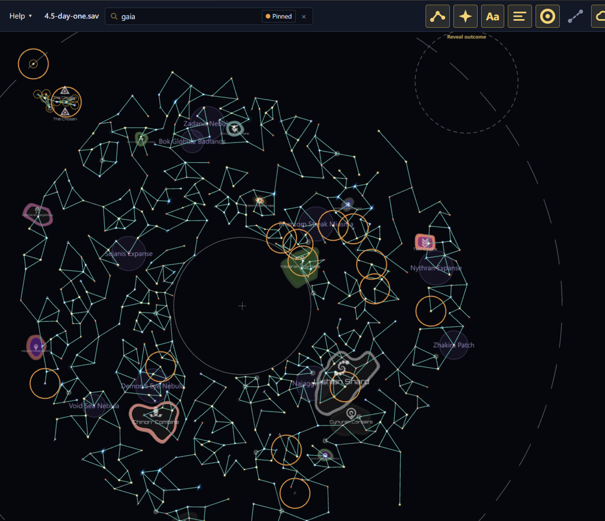
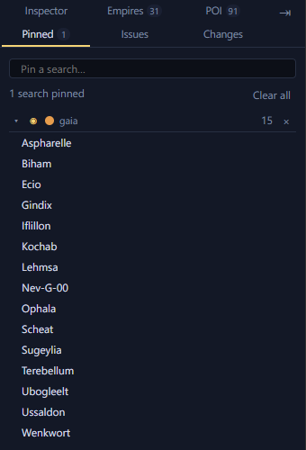

# Search <Badge type="tip" text="Save" /> <Badge type="info" text="Scenario" />

<kbd>F</kbd> opens search. <kbd>Ctrl</kbd>+<kbd>K</kbd> and <kbd>/</kbd>
open it too.

## Find a system, empire or planet

Search finds systems, empires, planets, fleets and nebulae, and systems
by what is in them, such as "gaia", or by their precursor, such as
"Vultaum". In a scenario it finds systems and nebulae.

<kbd>Enter</kbd> jumps to the highlighted result. <kbd>Shift</kbd>+<kbd>Enter</kbd>,
or <kbd>Shift</kbd>+click, adds its system to the selection and keeps
the search open. <kbd>Esc</kbd> closes it.

## Search one kind of thing

Start the search with a prefix to find one kind only:

| Prefix | Finds |
| --- | --- |
| `s:` | Systems |
| `e:` | Empires |
| `p:` | Planets |
| `f:` | Fleets |
| `n:` | Nebulae |

For example, `e:vex` searches empires for "vex". <kbd>Tab</kbd> moves
what you typed to the next kind, from everything to systems, empires,
planets, fleets, nebulae and back to everything.

## Pin a search

Pin a search to keep its systems ringed on every save.
<kbd>Ctrl</kbd>+<kbd>Enter</kbd> pins the search, or unpins it. The
Pinned searches tab in the dock lists your pins, and so does the empty
search box.

