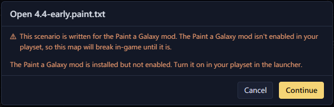
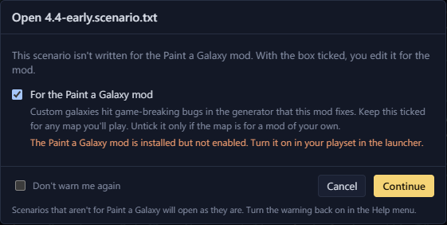

# Troubleshooting

## My edits are gone when I load the save

Steam Cloud has probably put the original save back over your edited
copy. Before you play an edited save, close Steam or turn off Steam
Cloud for Stellaris. See [Steam Cloud](../safety/steam-cloud.md).

## Save says the file changed on disk

Something, usually Stellaris, wrote the file after you opened it. The
dialog offers three choices:

- "Save As…" saves your edits to another file and leaves the game's
  version alone.
- "Overwrite" saves over it. The game's newer version is kept beside it
  as a backup.
- "Cancel" writes nothing.

## Open warns that Paint a Galaxy isn't enabled

The scenario is for the Paint a Galaxy mod, and the mod isn't in your
playset. Continue opens the file anyway. Before you play the map, turn
the mod on in your playset in the launcher. If the mod isn't installed,
subscribe to it on the Workshop first. See
[Export and play](../scenario/play.md#play-a-paint-a-galaxy-map).

## Open warns that a scenario isn't for Paint a Galaxy

The scenario was written without Paint a Galaxy. Keep "For the Paint a
Galaxy mod" ticked to edit it for the mod, which most maps need. Untick
it only for a map that belongs to a mod of your own. "Don't warn me
again" stops the question. "Warn on plain scenarios" in the Help menu
turns it back on. See [Paint a Galaxy](../scenario/paint-a-galaxy.md).

## Stars look plain and names look wrong

Galaxy Forge hasn't read your Stellaris install. The Game data pill in
the status bar says "Game data off" or "Game data unavailable". Click
it, then "Load now", or "Locate Stellaris…" to pick the game's folder.
See [Game data and mods](../start/game-data.md).

## Put the original save back

Galaxy Forge keeps a backup every time it saves. See
[Restore the original](../safety/saving.md#restore-the-original).

## The Issues tab warns about something

The Issues tab lists problems on the map, errors first. Each kind has a
section on the Issues page that says what it costs in game and how to
fix it. See [Issues](../safety/issues.md).

## Report a bug

Open an issue on
[GitHub](https://github.com/IanHeinrich/stellaris-galaxy-forge/issues)
and attach the save or scenario if you can. That makes the problem much
easier to reproduce. If you don't have a GitHub account, leave a comment
on the
[Workshop page](https://steamcommunity.com/sharedfiles/filedetails/?id=3805578137)
instead.
