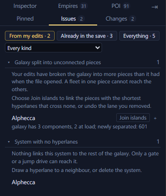

# Issues <Badge type="tip" text="Save" /> <Badge type="info" text="Scenario" />

The Issues tab lists problems with the map, errors first. <kbd>I</kbd>
opens it.

## Read the Issues tab

Errors are things the game can't be expected to cope with, such as a
hyperlane that exists at only one end. Warnings are worth a look, such
as a system with no hyperlanes. Click an issue to jump to it.

<Annotated :marks="[
  { n: 1, box: [8, 63, 320, 24], label: 'From my edits, Already in the file, Everything' },
  { n: 2, box: [8, 90, 200, 20], label: 'Show one kind of issue' },
  { n: 3, box: [8, 118, 330, 160], label: 'An issue: what it means, what to do, and the systems it affects' },
  { n: 4, box: [238, 232, 72, 20], label: 'A fix button' }
]">

</Annotated>

The sections below are every kind of issue the tab can show, with what
it costs in game and how to fix it.

## Hyperlane written at one end only

Stellaris writes a hyperlane into both of the systems it joins. Only one
end of this one is written. Cut the lane and draw it again, which writes
both ends.

## Hyperlane to a system that is not here

The lane leads to a system the file does not contain, so the map cannot
draw it. The editor cannot cut this one lane. Right-click the system and
choose Isolate, which clears every hyperlane it has, then draw the good
ones again.

## Hyperlane from a system to itself

The system is joined to itself. The map draws nothing for it. Open the
system and cut the lane to itself from its Hyperlanes list.

## The same hyperlane written twice

The file lists this hyperlane twice. Stellaris writes duplicates like
this in its own saves and they do no harm. Nothing needs doing. Deleting
the lane removes both copies.

## System with no hyperlanes

Nothing links this system to the rest of the galaxy. Only a gate or a
jump drive can reach it. Draw a hyperlane to a neighbour, or delete the
system.

## System outside the galaxy edge

The system sits further from the centre than the galaxy's own radius,
outside the edge the map draws. Drag it back inside the galaxy edge.

## Galaxy split into unconnected pieces

Your edits have broken the galaxy into more pieces than it had when the
file opened. A fleet in one piece cannot reach the others. Choose Join
islands to link the pieces with the shortest hyperlanes that cross none,
or undo the lane you removed.

## Nebula list does not match the map

The save lists each nebula's systems separately from where those systems
lie. Here the two disagree. Move the system or change the nebula's
radius until the two agree. The list itself cannot be edited here.

## Positions shifted before the game reads them

This scenario shifts every position before the game places its systems.
The map draws the positions as the file writes them, so the galaxy in
game will sit elsewhere. Nothing needs doing. Start a game on this map
to see where the systems land.

## Position written as a range

The position here is written as a range, and the generator picks a point
inside it every time it builds the galaxy. The map draws the middle.
Nothing needs doing. Moving the system pins it to one point.

## Wormholes and gates left behind

A scenario file has no way to say where a wormhole, a gateway or an
L-Gate goes. The export dropped the ones this save had. Nothing can put
them back. The galaxy settings decide how many the game places and
where.

## Seat on a start written for one empire

This seat stands on a starting system written for one named empire. The
generator offers that start to no other empire, so the seat fits only
the one that began there. Select the system and pick a generic start
with Choose… in the inspector's Initializer section. The Paint a Galaxy
export does this for you.

## System in a fallen empire's space

A system stands inside the ring where Paint a Galaxy builds this fallen
empire. The mod needs that ring clear. Move the system clear of the
ring, or fit the zones again.

## Two fallen empire zones overlap

Two zones' rings cover the same space, and the mod cannot build two
fallen empires there. Move one of the zones, or fit the zones again.

## Fallen empire zone off the edge of the map

The zone's centre lies off the canvas Paint a Galaxy paints on. The mod
has nowhere to build the fallen empire. Move the zone's system further
in, or fit the zones again.

## No fallen empire zones on the map

Paint a Galaxy builds fallen empires only where the map lays a ring for
them. This map lays none, so a game started on it gets none however many
you ask for. Press Fit zones… to lay some.

## Fallen empire with no way in

This zone takes hand-picked connections and no system links to it. The
fallen empire gets no hyperlane, so it starts cut off from the galaxy.
Press Use nearest systems to link the systems around it.

## Link to a fallen empire that is not there

This system is set to connect to a fallen empire zone, and no zone
claims that connection. Press Unlink to drop the connection.

## Two fallen empires share a connection

Both zones take the same connection, so every system linked to it joins
both fallen empires. Open one of the zones and give it a connection of
its own.

## Long link to a fallen empire

The link to this fallen empire zone reaches from further off than Paint
a Galaxy's own rule allows. The mod lays the hyperlane anyway. Nothing
needs doing. Link a nearer system if you want a shorter lane.

## Galaxy settings do not match the map

This file's settings and the map disagree on how many empires, fallen
empires or marauders there are. The new game screen will offer numbers
the map cannot seat. Press Update counts.

## Two seats reserved for the same empire

A reservation keeps a seat for the one empire that has its trait. More
than one seat here is reserved for the same empire, and it can only
start on one. Open a seat's Spawn point section and give it a different
reservation.

## More than one seat weighted for the player

You start on one of them. Which one comes down to the order the game
places empires in. Clear Weighted for its empire on the seats that are
not yours.

## System in the L-Cluster's space

When it generates the galaxy the game keeps a patch of space for the
L-Cluster, and this system stands in it. The map draws that patch as a
circle. Move the system clear of the circle if you want the L-Cluster
left to itself.

## Another file in the mod uses this name

Two files in the mod are listed under the same name. The game shows one
galaxy size per name, so one of them never reaches the new game screen.
Change the name in the galaxy inspector's Scenario header, or rename the
other file.

## Reserved seats need another mod

A seat reserved for one empire only works with the
[Reserved Spawns submod](https://steamcommunity.com/sharedfiles/filedetails/?id=3762808682). That submod is not in your playset, so these seats are filled at
random. Press Subscribe ↗, then enable the mod in your playset.

## Far more systems than the largest galaxy

The scenario has many more systems than the biggest galaxy size the game
and your mods offer. A galaxy this large can make the game slow, most of
all late on. Nothing needs doing if the game runs well for you.
Otherwise remove some systems.

## Initializer used more often than the game allows

The game limits how many systems may use this initializer. The systems
past the limit may not get what it makes, or the game may place it only
once. Give the extra systems another initializer.

## One marauder clan with two homes

A marauder clan has one home, and more than one system here claims to be
the same clan's. The clan spawns from only one of them. Give the others
a different clan's home, or an ordinary start.

## Outpost with no clan home beside it

An outpost only works with a hyperlane to its clan's home. This one has
none, so nothing spawns there. Draw a hyperlane from the outpost to its
clan's home.

## Marauder clan short of outposts

A marauder clan is its home and two outposts hyperlaned to it. This home
has fewer, and nothing in the game adds the rest. Press Add the
outposts.

## Marauder clan beside an empire seat

This clan's home stands close to an empire seat. Whoever starts there
takes the raids first. Nothing needs doing. Move the home away from the
seat if you would rather the raids were spread.

## Systems near a seat left for the game to fill

These systems have no initializer, so the game fills them at random when
a new game starts. Nothing keeps leviathans, marauder homes, L-Gates or
voidworms away from a capital. Give them an initializer, or apply
Prepare for a new game with Keep leviathans, marauders and L-Gates away
from starting positions ticked. It turns them into normal systems.

## Two bodies in the same place

Two planets or moons share an orbit and an angle, so the game draws one
on top of the other. Open the system view and drag one along its orbit,
or type a new angle on its planet page.
