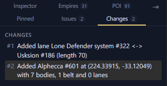

# Undo and the Changes tab

The Edit menu and the keys below step back and forward through your
edits.

## Undo an edit

<kbd>Ctrl</kbd>+<kbd>Z</kbd> undoes and <kbd>Ctrl</kbd>+<kbd>Y</kbd> redoes.

## Go back to an earlier point

The Changes tab lists every edit since you opened the file. Click one to
go back to that point.

