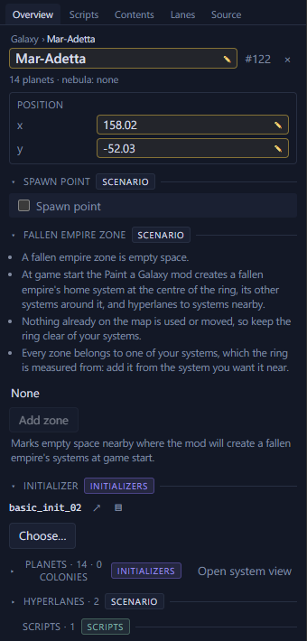

# Fallen empires, marauders and L-Gates <Badge type="info" text="Scenario" />

A scenario can say where fallen empires and marauder clans go.
Leviathans and the L-Gate come from initializers. A system with one of
those initializers gets a leviathan or the L-Gate there. The game can
also roll them onto the systems it fills at random.

## Add a fallen empire zone <Badge type="warning" text="Paint a Galaxy" />

On a map for Paint a Galaxy, right-click a system and select "Add fallen
empire zone". Drag the ring to move it, and drag from a system's ring
onto it to choose what the fallen empire connects to.

A system's page has Add zone in its Fallen empire zone section too.

## Add a marauder clan

Right-click empty space and select "Add marauder clan here". This adds
the clan's home and its two outposts.

To make a clan from systems already on the map, select three systems
joined by hyperlanes. Click "Make these marauder clan N" in the
Inspector, or select it from the right-click menu. The system with a
hyperlane to both others becomes the clan's home, and the other two its
outposts.

## Keep threats away from starting positions

In [Prepare for a new game](prepare.md#keep-leviathans-marauders-and-l-gates-away-from-starting-positions),
leave "Keep leviathans, marauders and L-Gates away from starting
positions" ticked and click Apply. Every system the game would fill at random within 2
hyperlane jumps of a starting position becomes a normal system.
