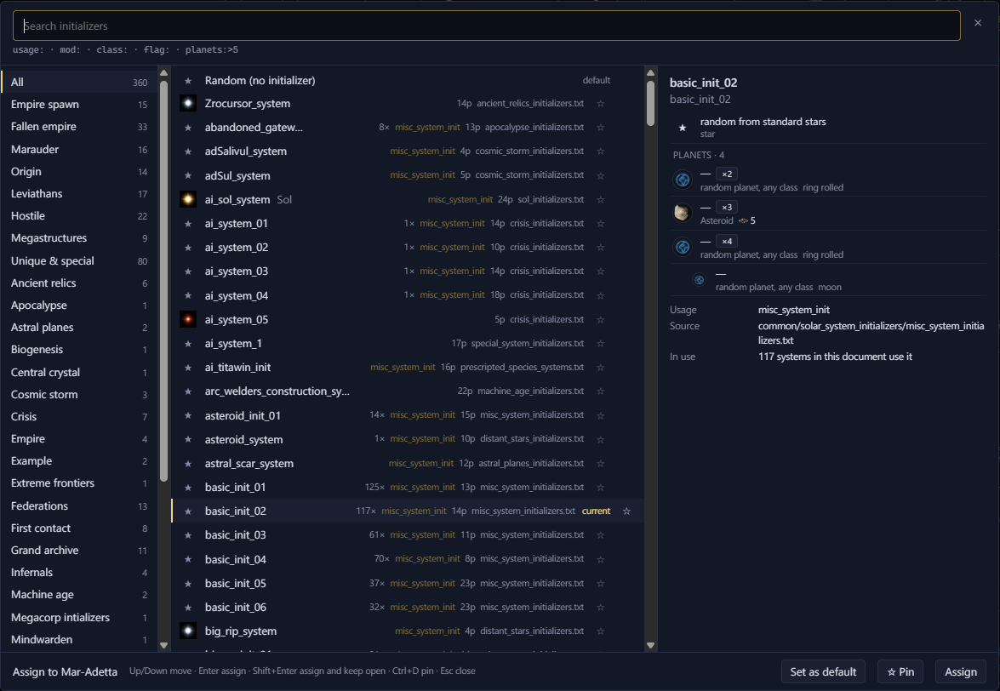

# Initializers <Badge type="info" text="Scenario" />

An initializer sets what a system spawns: its star, its planets and
anything else the game places there.

## Choose a system's initializer

<kbd>Shift</kbd>+<kbd>I</kbd> opens the initializer browser, which sets
what a system spawns. It shows what each one places before you assign
it.

<Annotated :marks="[
  { n: 1, box: [15, 13, 1115, 36], label: 'Search, with the filter prefixes listed under it' },
  { n: 2, box: [2, 80, 185, 690], label: 'Groups' },
  { n: 3, box: [203, 80, 555, 690], label: 'Initializers, with how often each is used, its planet count and its file' },
  { n: 4, box: [775, 80, 400, 450], label: 'What the selected initializer places' },
  { n: 5, box: [918, 775, 240, 30], label: 'Set as default, Pin and Assign' }
]">

</Annotated>

To add a new system from an initializer, see
[Add a system to a scenario](../edit/add-systems.md#add-a-system-to-a-scenario).
The [system view](../system/system-view.md#see-how-a-scenario-system-rolls)
shows what a system's initializer places.

## Filter the list

Type words to filter the list. Every word has to match. These prefixes
match one field only:

| Filter | Matches |
| --- | --- |
| `usage:` | The initializer's usage, as its file writes it |
| `mod:` | The mod's name, or the file the initializer is in |
| `class:` | The star class, as the file writes it or the game names it |
| `flag:` | The initializer's flags |
| `planets:>5` | Initializers with more than 5 planets. `planets:<5` and `planets:5` work too. |

The [Initializer keys layer](../map/layers.md#every-layer) shows each
system's initializer on the map.
