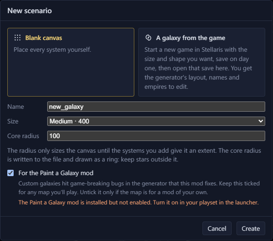
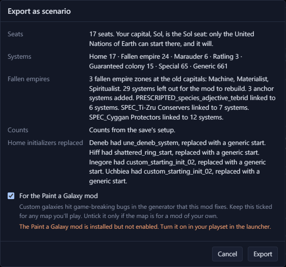
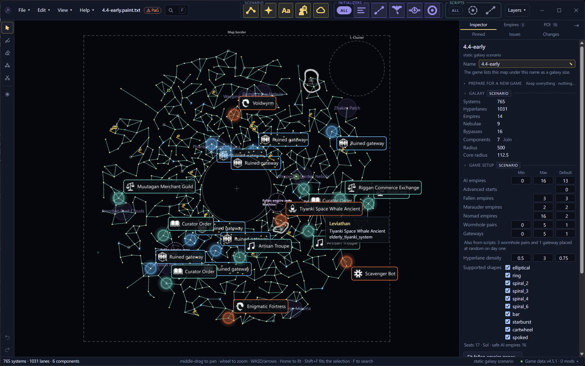
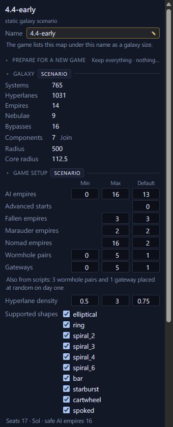

# Make a scenario <Badge type="info" text="Scenario" />

A [scenario](what-is-a-scenario.md) is a galaxy map that a new game
starts from. Start from a blank map or from the galaxy in a save.

## Start a scenario

There are three ways to make one:

- "New scenario…" then "Blank canvas" gives you an empty map.
- "New scenario…" then "A galaxy from the game" gives you the game's own
  layout, names and empires to edit:
  1. In Stellaris, start a new game with the size and shape you want.
  2. Save on day one.
  3. In Galaxy Forge, open that save as a scenario.
- Pick any save and click "Open as scenario", or use File → "Export as
  scenario…". The original save remains unchanged. After "Open as
  scenario", the Galaxy page opens with
  [Prepare for a new game](prepare.md).

<Annotated :marks="[
  { n: 1, box: [15, 57, 262, 140], label: 'Start from a blank canvas' },
  { n: 2, box: [284, 57, 262, 140], label: 'Start from a galaxy the game made' },
  { n: 3, box: [15, 208, 530, 82], label: 'Name, size and core radius' },
  { n: 4, box: [15, 347, 530, 75], label: 'For the Paint a Galaxy mod' }
]">

</Annotated>

Each route has a "For the Paint a Galaxy mod" checkbox.
[Paint a Galaxy](paint-a-galaxy.md#tick-the-paint-a-galaxy-checkbox)
explains it.

File → "Export as scenario…" lists what the export will change before
you click Export.

## Edit a scenario

You select and move systems, edit hyperlanes and edit nebulae as in a
save. A scenario adds these:

- [Add systems](../edit/add-systems.md#add-a-system-to-a-scenario),
  [rename any system](../edit/add-systems.md#rename-a-system) and
  [delete systems](../edit/add-systems.md#delete-systems).
- [Paint and erase systems](../edit/brushes.md#paint-and-erase-systems)
  with brushes, and [symmetry](../edit/brushes.md#use-symmetry).
- [Initializers](initializers.md), which set what a system spawns.
- [Spawn points](spawn-points.md).
- [Prevented lanes](../edit/hyperlanes.md#prevent-a-lane).
- [Fallen empire zones and marauder clans](fallen-empires-marauders-lgates.md).

## Set the counts for the new-game screen

With nothing selected, the Game setup section sets the counts offered
on the new-game screen, such as the number of AI empires.

On a map for Paint a Galaxy, click "Update counts" when Game setup says
the counts no longer match the seats and zones.

## See which tools wrote the file

The file starts with a `# created by` line naming the Galaxy Forge
version. Each time Galaxy Forge or Paint a Galaxy saves the file, it adds
itself to that line, so the line lists every tool and version that wrote
the file.

## Day-one estimates

The Scripts tab and the day-one layers estimate what scripts will do
when the game starts. Galaxy Forge can't follow every script, so they
can miss things.
