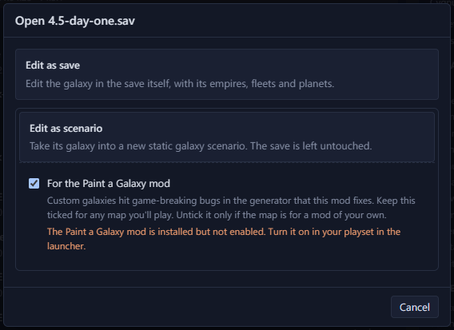

# Paint a Galaxy <Badge type="warning" text="Paint a Galaxy" />

The
[Paint a Galaxy mod](https://steamcommunity.com/sharedfiles/filedetails/?id=3532904115)
is a Steam Workshop mod for playing hand-made galaxies.

## Why use the mod

On a hand-made galaxy, Stellaris builds no fallen empires and gives
some empires a poor homeworld. The mod fixes both.

- The mod builds fallen empires in the fallen empire zones you place.
- Most empires on the game's random empire starts get a homeworld at 30
  to 50% habitability. The mod gives them a homeworld of their own class.
  A plain scenario from Galaxy Forge gives its seats ordinary systems
  instead, and the game builds each empire a homeworld of its own class
  there.
- Marauder clans you place in Galaxy Forge spawn with or without the
  mod. A clan made in Galaxy Forge has its home and both outposts.

## Tick the Paint a Galaxy checkbox

Each way of [making a scenario](make-a-scenario.md#start-a-scenario) has
a "For the Paint a Galaxy mod" checkbox, ticked by default. Keep the box
ticked for any map you plan to play. Untick it only for a mod of your
own.

When a save is converted for the mod, your capital becomes your seat and
each fallen empire becomes a fallen empire zone at its old capital. The
save's wormhole pairs stay. The L-Cluster is left out because the game
adds its own. [Prepare for a new game](prepare.md#what-a-save-keeps-as-a-scenario)
lists what else a converted save keeps.

A "PaG" badge in the top bar marks a scenario made for the mod. It also
warns you when the mod isn't installed or isn't enabled in your playset.

## What a Paint a Galaxy map adds

On a map for Paint a Galaxy you can also:

- set each seat's kind, on [Spawn points](spawn-points.md#choose-the-kind-of-seat)
- add [fallen empire zones](fallen-empires-marauders-lgates.md#add-a-fallen-empire-zone)
- [link wormhole pairs](../edit/wormholes.md#link-wormholes-on-a-paint-a-galaxy-map)
- [update the counts](make-a-scenario.md#set-the-counts-for-the-new-game-screen)
  in Game setup

## What the mod does on day one

- The mod builds fallen empires in the fallen empire zones. Your Fallen
  Empires setting decides how many.
- It opens your wormhole pairs.
- It gives each empire on a random empire start a homeworld of its own
  class.
- It adds guaranteed habitable worlds according to your Guaranteed
  Habitable Worlds setting.
- It adds two outposts beside a marauder clan home that has none. A home
  that already has one outpost gets no second one.
- The game adds its own L-Cluster and some event systems, such as the
  Sealed System.

Where each empire starts is on
[Spawn points](spawn-points.md#who-starts-where-on-day-one).

## The mod's limits

The mod's Workshop page lists its limits, which can change when the mod
updates. The Advanced Neighbors setting has no effect. Every precursor
is enabled. Sol gets no Sol-specific neighbours, and the Local Cluster
mod is the usual fix. Nomads with random homes don't start in a nomad
system.
