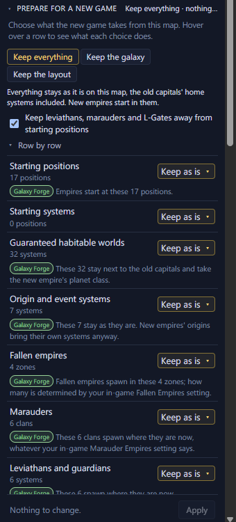

# Prepare for a new game <Badge type="info" text="Scenario" />

A save opened as a scenario keeps most of what the old game placed, such
as old capitals, origin systems, the systems events made and leviathans.
Prepare for a new game sets what the new game takes from the map, row by
row or from a preset.

## What a save keeps as a scenario

Every system keeps its position, name and initializer, and the
hyperlanes and nebulae stay. Each old capital becomes a seat. A few
things change on the way:

- On a plain scenario, an old capital on one of the game's random
  empire starts gets an ordinary starting system, so the game builds
  that empire a homeworld of its own class.
- The L-Cluster is left out, because the game adds its own.
- On a plain scenario, wormhole pairs are left out. A map for Paint a
  Galaxy keeps them, and the mod opens them on day one.
- Gateways and L-Gates are left out, unless the system's initializer
  builds one again.
- On a map for Paint a Galaxy, each fallen empire's systems become a
  fallen empire zone at its old capital.

File → "Export as scenario…" lists what it will replace and leave out
before you click Export.

## Open Prepare for a new game

After "Open as scenario", the Galaxy page opens this section on its own.
The Apply button stays in view at the bottom. Click "Not now" to see the
whole Galaxy page instead. On any scenario, use File → "Prepare for a
new game…", or select nothing and open the section on the Galaxy page.
It needs game data from your Stellaris install to sort the systems into
rows.

While the section is open, the map shows the galaxy as your choices would
leave it.

<Annotated :marks="[
  { n: 1, box: [8, 70, 210, 50], label: 'The three presets' },
  { n: 2, box: [8, 165, 330, 30], label: 'Keep leviathans, marauders and L-Gates away from starting positions' },
  { n: 3, box: [8, 226, 330, 480], label: 'Row by row: one choice per kind of system' },
  { n: 4, box: [250, 722, 85, 24], label: 'Apply' }
]">

</Annotated>

## Start from a preset

| | Keep everything | Keep the galaxy | Keep the layout |
| --- | --- | --- | --- |
| Starting systems | The old capitals' home systems | A random starting system at each old capital | New positions, drawn at random |
| Sol and origin systems | Kept | Normal systems | Rolled by the game |
| System names | Kept | Kept | Named by the game |
| Wormhole pairs, on a Paint a Galaxy map | Kept | Kept | Removed |
| Fallen empire zones | Kept | Kept | New zones on a Paint a Galaxy map |

- Keep everything leaves the map as it is, the old capitals' home
  systems included. New empires start in them.
- Keep the galaxy leaves the galaxy as it is, but every empire gets a
  random starting system at an old capital's position. Sol and the old
  origin systems become normal systems.
- Keep the layout keeps only the star positions, hyperlanes and nebulae.
  Galaxy Forge draws new starting positions, and on a Paint a Galaxy map
  new fallen empire zones. The game rolls everything else, as if this
  were a new random galaxy.

## Choose row by row

Under "Row by row" each row has its own choice, from Starting positions
to System names. Hover over a row to highlight its systems on the map
and to see a card beside the Inspector. The card says what the row holds and
what each choice does. Each choice has a tag for who places those things
in the new game:

- Galaxy Forge: this map places them, where you see them now.
- The game: Stellaris places them when the new game starts, by the
  in-game galaxy setting where one applies, otherwise at random. The map
  can't show where.
- No one: they aren't placed at all.

The same tags show in each row's list. Under a row you've changed, one
line says what that choice does.

A custom map gets no fallen empires without Paint a Galaxy, so on a
plain scenario the Fallen empires row can't be changed.

New random positions and New random zones are drawn by Galaxy Forge. The
map rings each new starting position and each new fallen empire zone,
and a legend at its bottom left counts them. Click Reroll to draw them
again.

## Keep leviathans, marauders and L-Gates away from starting positions

In a random galaxy the game keeps these threats away from empires. On a
custom map it doesn't, so a leviathan, a marauder clan or the L-Gate can
spawn right next to a starting position.

This box is ticked by default. Every system the game would roll within
2 hyperlane jumps of a starting position becomes a normal system
instead. Systems with an initializer that you keep are left as they
are. The line under the box counts the systems it changes. Hover over
the box to highlight them on the map.

## Apply your choices

Apply makes every change as one step, and <kbd>Ctrl</kbd>+<kbd>Z</kbd>
undoes it. On a scenario opened from a save, undoing Apply brings back
the Galaxy page with only this section.
