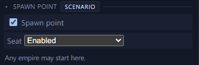
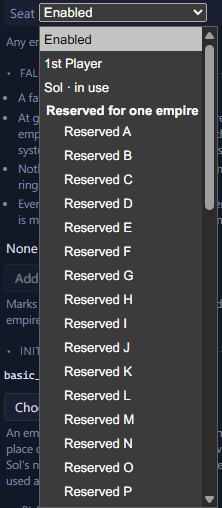

# Spawn points <Badge type="info" text="Scenario" />

A spawn point, also called a seat, is a system where an empire can
start.

## Set a spawn point

Right-click a system and select "Set as spawn point". The same menu has
"Remove spawn point".

The Spawn point checkbox on the system's page does the same.

## Choose the kind of seat <Badge type="warning" text="Paint a Galaxy" />

On a map for Paint a Galaxy, set each seat's kind. Enabled seats accept
any empire. The 1st Player seat is for you, or the host in multiplayer.
Sol is for the United Nations of Earth. Reserved seats A to Z and Alpha
to Omega are for one specific empire each. Reserved seats need the
[Reserved Spawns submod](https://steamcommunity.com/sharedfiles/filedetails/?id=3762808682).

## Keep a seat for one empire <Badge type="warning" text="Paint a Galaxy" />

1. Set the system as a spawn point.
2. On the system's page, set Seat to Reserved A.
3. Tick "Weighted for its empire".
4. Enable the Reserved Spawns submod in your playset beside Paint a
   Galaxy.
5. In Stellaris, give the species of the empire you want there the
   "Reserved Spawn: A" trait.

That empire is then certain to start on the seat.

## Who starts where on day one <Badge type="warning" text="Paint a Galaxy" />

- Each empire starts on a seat and brings its own home system. Anything
  the seat's initializer spawns nearby still appears. The planets shown
  on a seat are the ones that spawn if no empire starts there.
- Only the United Nations of Earth can start on a Sol seat. Only an
  empire whose species has the matching trait from the Reserved Spawns
  submod can start on a reserved seat. With "Weighted for its empire"
  ticked on the seat, that empire is certain to start there.
- A 1st Player seat goes to the first player, or the host in
  multiplayer. Another empire can still take it now and then. An AI
  whose origin needs a special starting place, such as Fear of the Dark,
  is placed before you and can take it. With "Weighted for its empire"
  ticked, you are all but certain to get it.
- A save converted for the mod gives your capital a weighted Sol seat if
  you play the United Nations of Earth, and a weighted 1st Player seat
  otherwise.
