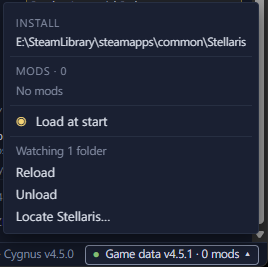

# Game data and mods <Badge type="tip" text="Save" /> <Badge type="info" text="Scenario" />

Galaxy Forge reads star art, names, planet classes and initializers from
your Stellaris install and the mods in your playset. The app calls this
game data. Nothing from the game comes with Galaxy Forge. It reads game
data each time it starts, unless you turn off Load at start.

## Set it up the first time

The first time you start Galaxy Forge, a "Before you start" card asks
about game data. Leave "Load Stellaris game data" ticked and click
Continue. Galaxy Forge finds a Steam install automatically. Loading
takes a few seconds at each start.

If you installed Stellaris somewhere else, click "Change install…" and
pick the Stellaris folder.

## Point it at Stellaris

When Galaxy Forge can't find the game, the card says "Stellaris was not
found". Click "Locate Stellaris…" and pick the folder the game is in,
such as `steamapps\common\Stellaris` in your Steam library.

Once a file is open, "Locate Stellaris…" is in the Game data panel too.

## Check what it loaded

The Game data button is at the right end of the status bar. It shows the
game version and how many mods it loaded, such as "Game data v4.5.1 · 0
mods". Click it to open the panel.

- Install shows the Stellaris folder it reads.
- Diagnostics lists files it couldn't read, when there are any.
- Mods lists the mods in the playset Stellaris last started with, in
  load order. A mod marked "missing" is in your playset but its files
  aren't on this machine.
- Load at start reads game data each time the app starts.
- Reload reads the install and your playset again. After you change
  your playset in the launcher, start Stellaris once with it, then click
  Reload.
- Unload clears game data from the app until you load it again. Your
  game files stay as they are.

## Keep up with mod updates

While game data is loaded, Galaxy Forge watches the install and mod
folders. When a file in them changes, such as a mod update, it reloads
that part by itself. The panel says how many folders it is watching.

If files change too often, the status bar shows "Auto-reload paused".
Click Resume to start watching again.

## Work without game data

You can edit without game data. The button then says "Game data off", or
"Game data unavailable" when it couldn't read the install. The map shows
plain stars and generated names. "Load now", in the panel or under the
Open screen's list, reads game data straight away.

You need game data for:

- Adding systems, planets and moons.
- Changing a star's class or a planet's class and look.
- The initializer browser, and the Initializers and Scripts layers in a
  scenario.
- The Precursors layer.
- Sorting a scenario's systems in
  [Prepare for a new game](../scenario/prepare.md).
