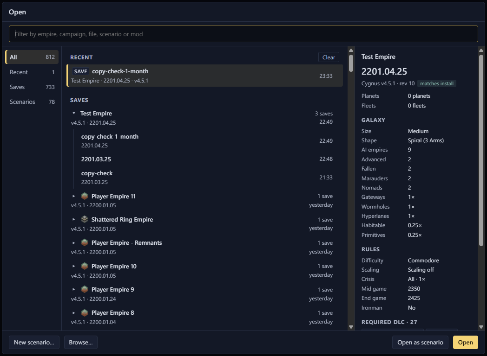

# Open a save or scenario

The Open screen is the first thing the app shows. It lists the files
Galaxy Forge can edit.

## Pick a save or scenario

The Open screen lists your saves by campaign, newest first, and the
scenarios in your install and your mods. It finds saves in the game's
save folder and in Steam's cloud folder. Cloud saves are marked "☁" (see
[Steam Cloud](../safety/steam-cloud.md)) and Ironman saves "⚿". On
the Saves tab, a save shows the name you gave it in the game, with its
date underneath.

<kbd>Enter</kbd> or a double-click opens the selected row. A save first
asks whether to edit it as a save or as a scenario.

<Annotated :marks="[
  { n: 1, box: [19, 55, 1010, 36], label: 'Filter the list by empire, campaign, file, scenario or mod' },
  { n: 2, box: [11, 109, 115, 125], label: 'All, Recent, Saves and Scenarios tabs' },
  { n: 3, box: [143, 112, 610, 600], label: 'Saves grouped by campaign, newest first' },
  { n: 4, box: [766, 112, 270, 600], label: 'Details of the selected save' },
  { n: 5, box: [18, 724, 195, 30], label: 'New scenario… and Browse…' },
  { n: 6, box: [843, 724, 190, 30], label: 'Open as scenario, or Open' }
]">

</Annotated>

## Reopen a recent file

The Recent list holds the last 10 documents you opened. The All tab
shows the newest 5, and "Show all" opens the rest under Recent. Clear
empties the list. Files you have deleted drop off it.

## Open any other file

"Browse…" opens any `.sav` or scenario `.txt` file. Once a document is
open, <kbd>Ctrl</kbd>+<kbd>O</kbd> brings the list back.
