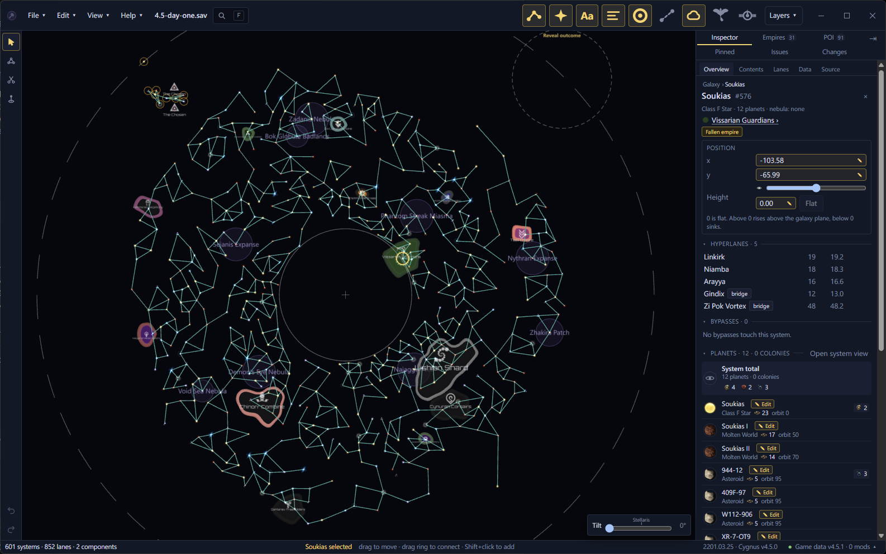
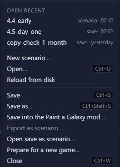
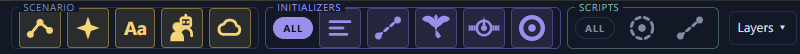

# The window <Badge type="tip" text="Save" /> <Badge type="info" text="Scenario" />

The map fills the middle of the window. The menus and layer buttons run
along the top, the tools down the left and the dock down the right.

<Annotated :legend="false" :marks="[
  { n: 1, box: [40, 12, 340, 32], label: 'Menus' },
  { n: 2, box: [380, 12, 66, 32], label: 'Search' },
  { n: 3, box: [933, 6, 505, 44], label: 'Layer buttons and the Layers menu' },
  { n: 4, box: [2, 58, 36, 130], label: 'Tool rail' },
  { n: 5, x: 330, y: 560, label: 'Map' },
  { n: 6, box: [1248, 55, 336, 50], label: 'Dock tabs' },
  { n: 7, box: [1248, 110, 336, 855], label: 'Inspector' },
  { n: 8, box: [2, 900, 36, 60], label: 'Undo and redo' },
  { n: 9, box: [1052, 922, 185, 40], label: 'Tilt' },
  { n: 10, box: [0, 968, 1240, 25], x: 620, y: 968, label: 'Status bar' },
  { n: 11, box: [1405, 968, 175, 24], label: 'Game data pill' }
]">

</Annotated>

## Find your way around the window

1. The File, Edit, View and Help menus, and the name of the open file.
2. Search. Press <kbd>F</kbd> to find a system, empire or planet. See
   [Search](../map/search.md).
3. The layer buttons switch the main layers on and off. The Layers menu
   at the end lists every layer. See [Layers](../map/layers.md).
4. The tool rail: Select, Connect lanes and Cut lanes. A save adds the
   Height brush, and a scenario adds Paint systems and Erase systems.
   See [Brushes and symmetry](../edit/brushes.md).
5. The map. See [Move around the map](../map/navigate.md).
6. The dock tabs: Inspector, Empires, Points of interest, Pinned
   searches, Issues and Changes.
7. The Inspector shows what you selected. With nothing selected, it
   shows the whole galaxy.
8. Undo and redo. Point at one to see which edit it undoes or redoes.
   See [Undo and the Changes tab](../safety/undo.md).
9. Tilt, in a save. It leans the map so you can see
   [system heights](../edit/heights.md). The Stellaris mark is the
   game's own camera angle. Double-click the slider to lay the map flat.
10. The status bar. On the left it counts systems, lanes and
    components, the separate pieces of the galaxy. In the middle it names what you selected and says what
    the mouse does there.
11. The Game data pill shows the game version and mods Galaxy Forge
    read. See [Game data and mods](game-data.md).

<kbd>Tab</kbd> hides the dock and shows it again, so the map gets the
whole width.

On a Mac, read <kbd>Cmd</kbd> wherever this guide says <kbd>Ctrl</kbd>.

## Use the File menu

- Open recent lists the last four files you opened.
- "New scenario…" starts a scenario from a blank map or a save. See
  [Make a scenario](../scenario/make-a-scenario.md).
- "Open…" (<kbd>Ctrl</kbd>+<kbd>O</kbd>) brings back the
  [Open screen](open.md).
- "Reload from disk" reads the file again. It asks first if you have
  unsaved edits.
- "Save" and "Save as…" write your edits. See
  [Save, back up and restore](../safety/saving.md).
- "Save into the Paint a Galaxy mod…" saves a scenario where the mod
  finds it. See [Export and play](../scenario/play.md).
- "Export as scenario…" writes the open save as a new scenario file.
- "Open save as scenario…" picks a save and opens it as a scenario.
- "Prepare for a new game…" chooses what a new game takes from a
  scenario. See [Prepare for a new game](../scenario/prepare.md).
- "Close" (<kbd>Ctrl</kbd>+<kbd>W</kbd>) closes the file.

Items that don't fit the open file are greyed out.

## Use the Edit, View and Help menus

The Edit menu has Undo, Redo, Select all and Delete. The View menu fits
the galaxy or the selection to the window, opens the system view, hides
the dock and resets the layers.

The Help menu shows the version you're running. "User guide" opens this
guide in your browser. "Check for updates…" looks for a new release, and
"Releases page" opens the downloads on GitHub. See
[Install and update](install-and-update.md#update-the-app).

## See the top bar change with the file

The top bar shows the layers and tools that fit what is open. In a
scenario the layer buttons sit in three groups: Scenario, Initializers
and Scripts. "All" switches a whole group. A scenario for Paint a Galaxy
also shows a "PaG" badge.

In a [system view](../system/system-view.md), the bar shows that
system's layers instead.
