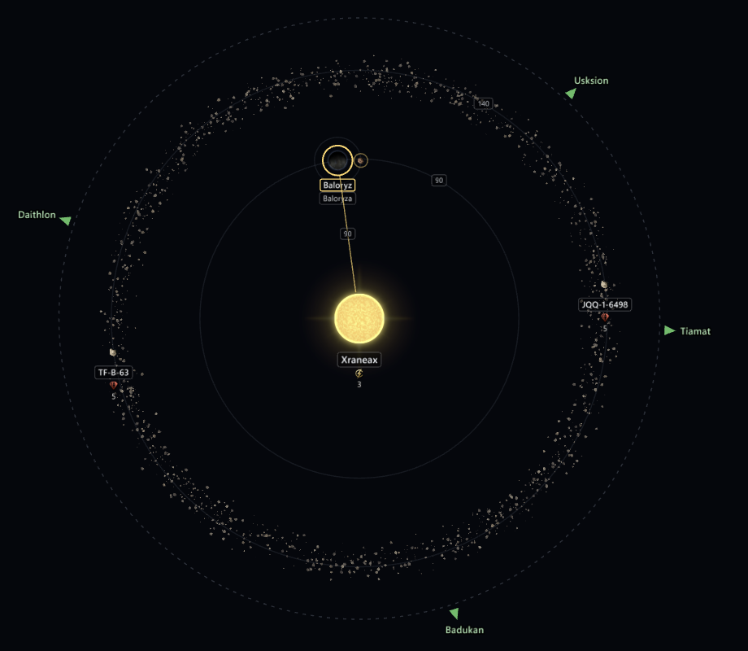
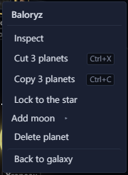

# Arrange planets and moons <Badge type="tip" text="Save" />

In the [system view](system-view.md) you can drag bodies to new orbits
and add planets and moons. To take one out, see
[Delete a planet or moon](colonies.md#delete-a-planet-or-moon).

## Move planets and moons

In a save, you can move planets, moons and asteroids. In a binary or
trinary system you can move the stars too, and their planets move with
them. A star at the system's centre stays where it is. Ring world
segments stay where they are too, and can't have moons.

Drag a body to move it. Its distance and its angle both follow the
pointer, in whole units and whole degrees. Near another orbit, it lands
on that orbit. Hold <kbd>Shift</kbd> to snap the angle to 15° steps.
Hold <kbd>Ctrl</kbd> to change only one of them: drag along the orbit to
change the angle, or across orbits to change the distance. While
<kbd>Ctrl</kbd> is held, the body stays with what it orbits. Its moons
move with it. Press <kbd>Esc</kbd> during a drag to put it back.

## Make a planet a moon, or a moon a planet

Drop a planet on another planet to make it a moon of that planet. Drag
a moon away from its planet to make it a planet again. A planet that
has moons of its own can't become a moon. A moon keeps its name after
it moves to another planet, so Sol IIIa can end up orbiting Sol IV.

In a binary or trinary system, drop a planet on another star to make it
orbit that star. Its moons come with it. It lands where you drop it,
clear of the star, and on one of the star's orbits when it's near one.
To bring it back, drop it on the star at the centre or drag it well away
from its star.

## Lock a body to what it orbits

To move a body without it becoming a moon or leaving what it orbits,
right-click it and choose Lock to, followed by what it orbits. A locked
body shows a small lock. You can still drag it along its orbit and out
or in, but it stays with its planet or star. Choose Unlock on the same
menu to let it go. The lock only lasts while the save is open and isn't
saved in the file.

## Move a body with the keyboard or by number

<kbd>Shift</kbd>+arrow moves the body whose page is open. Left and Right
move it along its orbit, and Up and Down move it out and in. Each press
moves it 1° or 1 unit. <kbd>Ctrl</kbd>+<kbd>Shift</kbd>+arrow moves it
10. The arrows on their own still pan the view.

You can make the same edits in the Orbit block on the body's page.

- Orbits picks the star at the centre, another star or a planet. A new
  moon goes on the next free moon orbit of its planet. A planet moved to
  another star goes just past that star's outermost planet. A body moved
  to the star at the centre stays where it is.
- Orbit radius is its distance from what it orbits.
- Angle is where it stands on that orbit, in degrees. A moon's radius
  and angle are measured from its planet.

If you move a planet or a belt near or past the system's inner radius,
the inner radius moves out with it. How far out follows the defines in
your install and mods. The system view draws the hyperlane exits on the
inner radius circle.

## Add planets and moons

In a Stellaris 4.x save, right-click empty space in the system view and
choose Add planet here. Pick Random, or a planet class from the list.
Each class shows the sizes it comes in. The planet lands where you
right-clicked.

To add a moon, right-click a planet and choose Add moon. The moon goes on
the next free moon orbit of its planet.

The rest is rolled by the game's own rules. Random picks a class that
suits the orbit, the size comes from the class's range, and the body gets
the deposits a new body would. The new body is selected and its page
opens, so you can change its name, size and deposits there. Adding it is
one edit, so one undo takes it away.

- A new planet takes the numeral after the system's highest, so a planet
  added to Meissa after Meissa IV is Meissa V. A moon takes the letter
  after its planet's moons, so the first moon of Meissa IV is Meissa IV a.
- Stars, moons and asteroids can't be given a moon.
- Adding a planet or moon needs game data loaded.
- If a new planet or moon sits past the system's inner radius, the inner
  radius moves out with it, as it does when you move a planet there.
- The body starts unsurveyed. The game adds the rest when the save loads.
