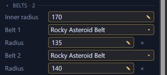

# Asteroid belts and the inner radius <Badge type="tip" text="Save" />

A system can have asteroid belts. Its
[inner radius](../reference/glossary.md#inner-radius) is the circle its
hyperlane exits sit on. You change both on the system's page or in the
system view.

## Change belts on the system's page

The system's page has a Belts section. You can change the inner radius
and each belt's kind and radius there, or remove a belt. Removing a belt
leaves its asteroids where they are. Changing a belt's radius moves its
asteroids with it. The kinds come from your install, so you need the
game data loaded to change one.

## Change belts in the system view

In the [system view](system-view.md), each belt and the inner radius
has six small ring handles. They show when you hover over the belt or
the circle. Drag any of them to change the radius. Right-click a belt's
handle and select Remove belt to remove it. Its asteroids stay where
they are. Right-click empty space and select Add belt here to add a belt
at that distance from the star.
