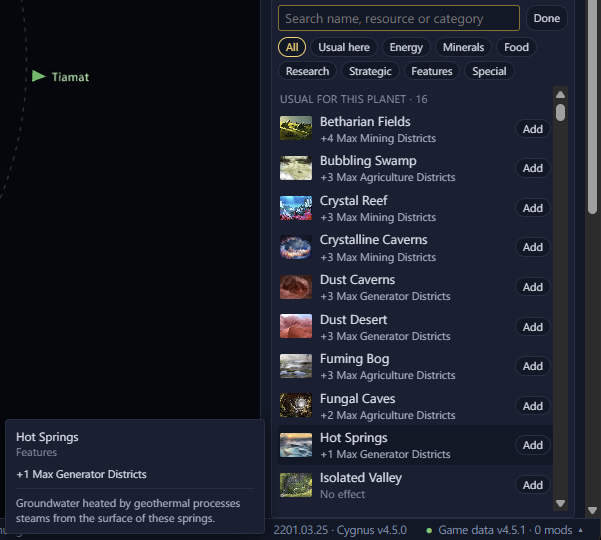

# Deposits and modifiers <Badge type="tip" text="Save" />

These sections are on a [planet's page](planet-pages.md), below its
name, size and class.

## Add or remove a deposit

Deposits show with the game's own art, one row per type. Each row says
what the deposit yields, or what it does while unworked. The district
capacity they all add up to shows at the top of the section. A blocked
deposit shows a blocker mark, the tech and resources needed to clear
it, and how long clearing takes.

Remove a deposit with the ✕ on its row. To add one, click Add deposit
under the deposits. It lists every deposit type except blockers, which
have a list of their own. The ones the game places on that body come
first, under "Usual for this planet". Type to search by name, resource
or category, or pick a category chip. Special holds the deposits only
events place. Orbital deposits of one resource, such as +1 to +10
Energy, share a row: click an amount to add that one.

Add blocker, under the Blockers heading, works the same way for
blockers. Its chips pick the blockers a tech clears, the ones that need
no tech or can't be cleared, and Special for blockers that do more than
take away districts. The heading shows even when the body has none.

Both lists stay open until you click Done or press <kbd>Esc</kbd>. A
mining or research station over a removed deposit stays in game and
still costs about 1 energy a month.

The bottom of the deposit, blocker, modifier and dig site lists shows
the game's description of the row you hover over. Without the pointer
on a row, it describes the row the arrow keys are on.

## Change deposits on a colony

Colonised planets take deposit edits too. The game applies them on its
next monthly tick. When an edit may cost the colony districts,
buildings or a clearing in progress, the page warns you first. You then
click Remove anyway or Add anyway, or Cancel.

- Districts over a lowered cap are demolished. The save doesn't store
  the caps, so the page counts what the deposits give. It says "may"
  when something else adds to the cap too.
- A zone or building that needs the removed deposit goes, such as
  Crystal Mines without a rare crystals deposit, or the Xeno Zoo
  without Alien Pets.
- Removing a blocker that is being cleared cancels the clearing. What
  was spent on it isn't refunded.

When a planet finishes terraforming, the game changes its deposits,
including any you added.

## Add or remove a modifier

In a Stellaris 4.x save, the Modifiers section lists a planet's
features and timed modifiers, each with what it changes and how many
days are left. Remove one with the ✕ on its row. Add modifier, under
the list, lists the modifiers that act on a planet, its pops or its
jobs. Search by name or effect, or pick a chip: Features, Terraforming,
Positive, Negative or Other. Pick Permanent or a number of days before
you click Add. A timed modifier ends in game after that many days.
Adding or removing a timed modifier does what the console's
`add_modifier` and `remove_modifier` do. A planet feature also has a
line of its own, which is added and removed with it, as the game writes
a rolled feature.

## Make a planet a terraforming candidate

A barren, frozen, toxic or grey goo world's terraforming candidate
modifier is at the top of Add modifier, under "Usual for this planet".
With it, the planet can be terraformed once the empire has Climate
Restoration. Toxic worlds also need Detox. Frozen worlds also need
Hydrocentric and an aquatic species, and can only become ocean worlds.

## Add or remove an anomaly

In a Stellaris 4.x save, the Anomaly section shows the anomaly on a
planet, moon or star: its name, which empires have found it, and the
game's description of it. Remove it with the ✕ on its row. When it has
none, Add anomaly lists the anomalies you can add. Search by name, or
pick a level chip. The ones that can turn up on that body come first,
under "Usual for this planet". Some only turn up on stars, such as the
ones around pulsars and black holes. A body holds one anomaly, so the
list closes after you add one.

If you have surveyed the planet, the added anomaly shows in game right
away, ready for a science ship to research. If you haven't, it turns up
when you survey the planet. Anomalies that run their own script when
the game places them, such as precursor ones, aren't offered, because
the game wouldn't run that script. The AI's own anomalies aren't
offered either.

In an older save, a planet with an anomaly waiting on it shows an
Anomaly row in About: the anomaly's name, and which empires have found
it.

## Add or remove a dig site

In a Stellaris 4.x save, the Dig site section shows a planet's
archaeological site: its stage, its clues, whether a fleet is
excavating it, and the game's description of it. Remove it with the ✕.
A science ship excavating a removed site stops on the game's first day
and waits in orbit. A planet without a site has Add dig site. Search by
name, or pick Found by surveys or Event only. A planet holds one site,
so the list closes after an add. Sites that run a script when the game
creates them, such as Ruined Station and The Library, aren't listed,
because the game wouldn't run that script for an added site.
