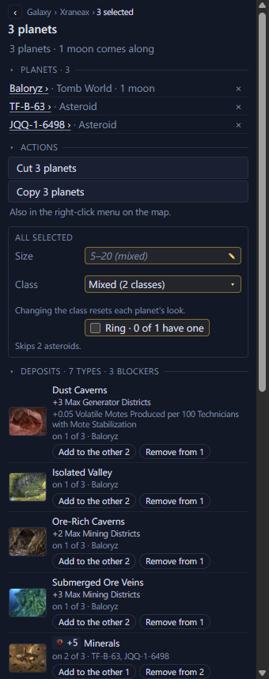

# Edit several planets at once <Badge type="tip" text="Save" />

In a Stellaris 4.x save, select planets in the
[system view](system-view.md) with <kbd>Ctrl</kbd>- or
<kbd>Shift</kbd>-click. The Inspector lists them, and below the list are
the [planet page's](planet-pages.md) fields for all of them at once.

<Annotated :marks="[
  { n: 1, box: [8, 87, 330, 80], label: 'The selected planets' },
  { n: 2, box: [8, 200, 330, 56], label: 'Cut or copy them all' },
  { n: 3, box: [8, 295, 330, 155], label: 'Fields that change every selected planet' },
  { n: 4, box: [8, 468, 330, 380], label: 'Deposits, with Add to the other and Remove from' }
]">

</Annotated>

## Change their size, class or ring

- Size shows the size they share, or their range in grey. Type a size
  and press <kbd>Enter</kbd> to give it to every selected body. The star
  takes it too.
- Class lists only the classes every selected planet can take. A colony
  keeps the list to the classes a colony can have, and a moon leaves out
  the classes a moon can't have. A warning under the field names the
  planets that make the list shorter.
- Ring is ticked when every planet has a ring and partly ticked when some
  do. Click it to give a ring to the rest, and again to take every ring
  away. Stars, asteroids, ring world segments and moons without a ring
  are left out.

## Change their deposits and modifiers

Deposits and Modifiers list one row for each type any selected planet
has, and say which planets have it. Add to the other N gives it to the
planets without it. Remove from N takes one off each planet that has
it. Add deposit, Add blocker and Add modifier work as on a planet's
page, for every selected planet. A star takes deposits but no
modifiers.

## Good to know

A line under each field says which bodies it leaves out. Hover it to
see why for each one.

Each change is one edit, so one undo puts every planet back. A line
under the section says what the last change did and which planets it
skipped.
