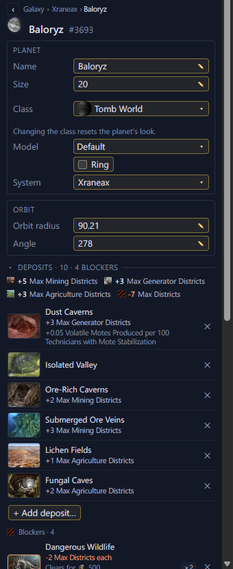

# Planet pages <Badge type="tip" text="Save" />

Click a body in a system's Planets list, or a moon in a body's own Moons
list, to open its page in the Inspector. [Search](../map/search.md) finds
a planet by name too.

A star's page opens with its type and size to edit, as
[Stars](../edit/stars.md) describes. Moons are listed below a planet and
open their own pages the same way.

<Annotated :marks="[
  { n: 1, box: [8, 86, 330, 85], label: 'Name, size and class' },
  { n: 2, box: [8, 203, 330, 47], label: 'Model and ring' },
  { n: 3, box: [8, 255, 330, 22], label: 'The system it is in' },
  { n: 4, box: [8, 298, 330, 70], label: 'Orbit radius and angle' },
  { n: 5, box: [8, 388, 330, 340], label: 'Deposits and blockers' },
  { n: 6, box: [10, 736, 110, 24], label: 'Add deposit…' }
]">

</Annotated>

## Rename a planet or moon

Rename a planet or moon in its Name field. Moons named after a planet
take its new name too.

## Change a planet's size

Change a planet's or moon's size in its Size field. On a colony, the
game demolishes districts over a lowered cap within a month.

## Change a planet's look

In a Stellaris 4.x save, change a planet's or moon's look in its Model
field, such as the Ocean Paradise, Earth or Previously Terraformed
look. The looks the game uses on the planet's class come first.
Select Default to go back to the look of the planet's class. Terraforming
or any other class change in game also resets the look.

## Change a planet's class

In a Stellaris 4.x save, change a planet's or moon's class in its
Class field. Deposits, modifiers and any colony stay as they are. The
planet takes the new class's look, and the Model field can set
another. A colonised planet can only change to another habitable class with
ordinary districts, such as continental, ocean or tomb world. Stars,
habitats, ring worlds, arks and other special worlds keep their class.

## Add or remove a ring

In a Stellaris 4.x save, a planet has a Ring checkbox to give it a
ring or take its ring away. A moon only has the checkbox while it has
a ring, so you can take it off.

## A scenario body's page <Badge type="info" text="Scenario" />

In a scenario, a body's page shows what its initializer says about it.
It has the Name, Class, Size, Ring and Model rows, each set by the
initializer, rolled by the game or decided when the game starts. When
the initializer places several planets like this one, a line under the
name says how many and when the game places this one. The page also lists the deposits,
modifiers, anomaly and flags the initializer states. A start planet has
a "start planet" mark and a Start planet row. The Initializer section
shows the lines the initializer runs for the body, and its other keys.
Nothing on the page can be edited yet.

## Go back

Use the breadcrumb above the page to go back. Click "‹" to go back one
step, a name in it to go to that page, or "Galaxy" for the Galaxy page.

Deposits, modifiers, anomalies and dig sites are on
[Deposits and modifiers](deposits-and-modifiers.md). A planet's colony
is on [Colonies and deleting planets](colonies.md).
