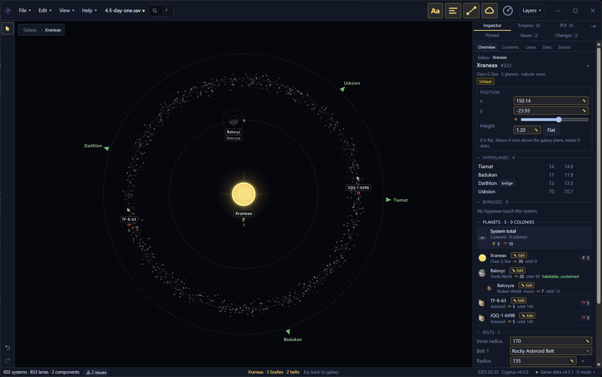
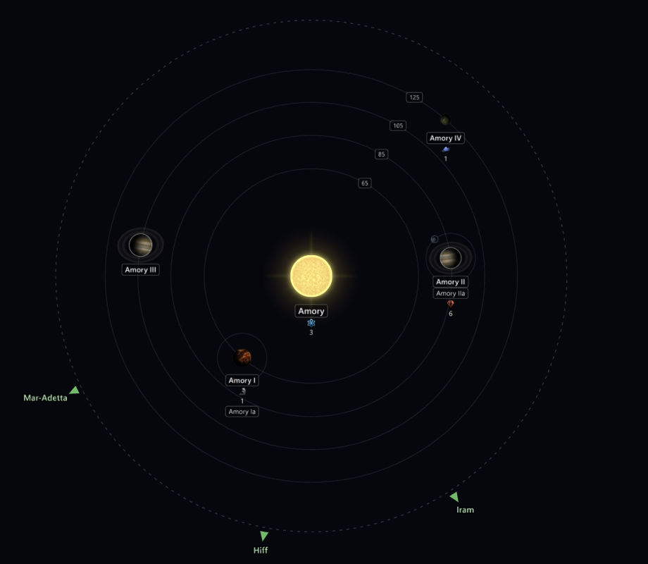

# System view <Badge type="tip" text="Save" /> <Badge type="info" text="Scenario" />

Open one system to see its star, planets, moons and asteroid belts laid
out as they are in the game.

## Open a system

To open a system:

- Double-click the system on the map.
- Select the system and press <kbd>Enter</kbd> or <kbd>M</kbd>.
- Right-click the system and select Open system view.
- Click Open system view in the Planets header of the system's page.
- Select the system and use View → Open system view.

Each body sits on its orbit around the star, or around its planet for a
moon. Hyperlanes show as arrows at the edge, pointing to the
neighbouring systems. Click an arrow to see the lane's length.
Double-click it to open that neighbour's view. Scroll to zoom and drag
with the middle mouse button to pan, as on the galaxy map. A large save
can take a moment to read a system, and the status bar says "Reading the
system…" until the bodies appear.

The status bar counts the system's bodies and belts. With a body's page
open in the Inspector, it shows that body's orbit and angle.

## See how a scenario system rolls <Badge type="info" text="Scenario" />

Systems in a scenario open the same way and show what their
[initializer](../scenario/initializers.md) sets. Where it leaves an orbit
or an angle to chance, the view shows one possible layout. Click Roll
again next to the system's name, or use View → Roll again, to see
another. A random planet class shows a question mark.

Select a scenario body to see its ranges. The band is the range its
distance can fall in, and the wedge is the range of its angle. The body
or orbit that the distance and angle are measured from is outlined in
blue. The body's page lists its orbit step, its angle step and whether
it has a ring. Click the name in the angle step to go to the body it
turns from.

Some blocks of an initializer place a range of planets, such as 2 to
10. The view draws every planet the block can place. The ones past the
lowest count have a dashed halo, because the game may not place them.

A scenario system whose initializer is `random`, missing or unknown to
your install gets its planets rolled when the game starts. An
initializer that places its planets only through a script works the
same way. The view shows faint placeholder planets for such a system,
rolled by the game's rules for its star. The game rolls its own planets
at the start, so they won't match the placeholders. You can't select
the placeholders.

## Rolled values and how many planets spawn <Badge type="info" text="Scenario" />

The system's page in the Inspector shows what the initializer places,
in the same sections a save's page has. The line under the name counts
planets only, as it does for a save. Moons and asteroids are counted in
the System total row at the top of the Planets section. A count the game rolls shows as a range, such as
"2 to 10 planets".

Values show in one of three ways:

- A value the initializer sets shows as plain text, as in a save.
- A value the game rolls when the game starts shows in blue with a small
  square mark. Hover over it to see "Rolled when the game starts".
- A value the game decides in a way Galaxy Forge can't show is in grey
  italics with a question mark. Where Galaxy Forge knows why, the reason
  is under it.

Some initializers place a planet a random number of times. The Planets
list shows those planets as one row, such as "Random planets", with the
count at the right, such as "1 to 4". Hover over the count to see what
it means. Click the row to open the first of them. A planet that may not
spawn, because some games don't have it, shows "0 to 1". The system view still
shows every planet the game can place, with a dashed ring on the ones
not every game has. A star drawn from a star list has a Star class
section that lists the list's star classes with their odds.

## A scenario system's Initializer section <Badge type="info" text="Scenario" />

The Initializer section starts with the initializer's name and the
Change… button, or Choose… on a system that has no initializer. Under it are the kind of system it makes and the file
it comes from. Click Open file to open that file in your editor, or
Show in folder to find it. Galaxy Forge doesn't change the file.

The rows below say which empire or creature the initializer creates,
how many of these systems a galaxy can have, and which values come from
a variable or an inline script. Three groups follow:

- Script it runs lists the lines the game runs when it builds the
  system. On a scenario map they run before hyperlanes exist.
- Random galaxy settings are the keys a random galaxy uses to decide how
  often to add the system. Your map already places it, so they have no
  effect.
- Other keys lists the initializer's keys that Galaxy Forge keeps but
  doesn't show elsewhere.

Click a group's heading to close it. Script text shows as the file
writes it, in the colours of the CWTools extension for VS Code. Click
"Show all" under a long piece to see the rest.

The Source tab shows the system's own text, laid out one line per key
as in a game file. Your file keeps its own layout. Text an edit changed
is highlighted, with a bar at the left of its line. Nothing on a scenario system's page can
be edited yet.

## Show orbit radii

Press <kbd>2</kbd> in a system view to turn on Orbit radii. Each orbit
shows its radius. The selected body always shows a line out to it with
its radius.

## Names and layers in a system

Each body's name sits on a plate under it. A colonised planet's plate
has a bar in its owner's colour. Names, System details, Nebulae and,
in a save, Bypasses still work while a system is open, with their own
settings, so you can have them on in the galaxy and off in a system.
With System details on, each body's resources show under its name. A
colony's name shows its owner's flag. A body's name also shows icons
for its megastructures, dig site, anomaly and pre-FTL civilisation.
Hover over an icon or a resource to see what it is. A system inside a
nebula shows faint clouds behind it while Nebulae is on. The other
layer buttons and the tool strip are for the galaxy, so they are hidden
while a system is open. Undo and redo still work from the Edit menu and
their keys.

## Go back to the galaxy

Press <kbd>M</kbd>, click "Galaxy" in the breadcrumb at the top left of
the map, right-click and select Back to galaxy, or use View → Back to
galaxy. <kbd>Esc</kbd> and <kbd>Backspace</kbd> go back too once the
Inspector has no page left to step back from. The galaxy map is where
you left it.
